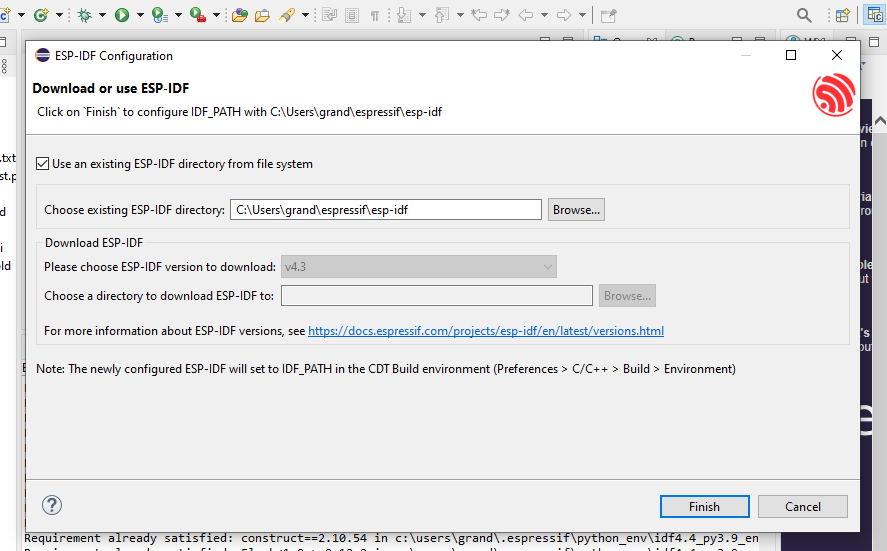
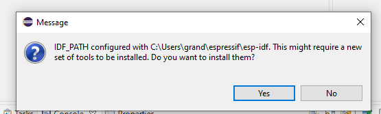
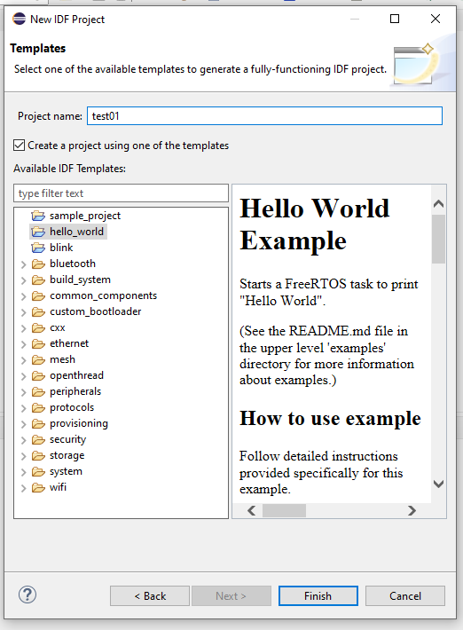
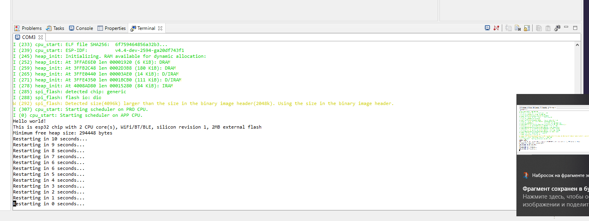

# Урок 1. Установка и настройка окружения esp-idf под Linux & Windows.
- [Урок 1. Установка и настройка окружения esp-idf под Linux & Windows.](#урок-1-установка-и-настройка-окружения-esp-idf-под-linux--windows)
  - [Espressif <div id="espressif"></div>](#espressif-div-idespressifdiv)
    - [Почему, Esp32? <div id="whyesp32"></div>](#почему-esp32-div-idwhyesp32div)
    - [Сравнение <div id="compare"></div>](#сравнение-div-idcomparediv)
      - [ESP32](#esp32)
      - [STM](#stm)
    - [Полезные ссылки <div id="usefullinks"></div>](#полезные-ссылки-div-idusefullinksdiv)
    - [Установка и настройка консольного инструментария esp-idf](#установка-и-настройка-консольного-инструментария-esp-idf)
      - [Linux <div id="linux"></div>](#linux-div-idlinuxdiv)
        - [esp-idf <div id="espidfonlinux"></div>](#esp-idf-div-idespidfonlinuxdiv)
        - [VSCode <div id="espidflinuxvscodeplugin"></div>](#vscode-div-idespidflinuxvscodeplugindiv)
        - [Eclipse <div id="espidflinuxeclipseplugin"></div>](#eclipse-div-idespidflinuxeclipseplugindiv)
      - [Windows](#windows)
        - [esp-idf](#esp-idf)
        - [VSCode](#vscode)
      - [Eclipse](#eclipse)

## Espressif <div id="espressif"></div>

### Почему, Esp32? <div id="whyesp32"></div>

Esp32 использует два процессора Xtensa с симметричной адресацией. Это разработка Гарварда, сделанная аж в 1997 году. Заявленная тактовая частота 240/160 МГц.
Частота таймеров 80 МГц

Очень низкое энергопотребление в режиме «глубокого сна» — 5-2,5 мкА.

Аналогичные по архитектуре модули STM32, скажем  стоят значительно дороже. Да, 400 МГц, да отличная документация. Но, скажем процессор STM32F407 стоит около 1000 рублей на АлиЭкспрессе.

Почти нет микропроцессоров, у которых были бы «на борту» Bluetooth и Wi-Fi стоимостью 150-200 рублей.

Удобные для любительской распайки модули с микропроцессором «на борту»
Можно сказать, что в сегменте [DIY](#DIY) у модуля с процессором ESP32 конкурентов нет.

<div id="DIY"></div>Самодельничество, гаражные разработки, «сделай сам» (англ. DIY — Do It Yourself), — вид деятельности, при котором люди самостоятельно производят какие-либо изделия для собственного использования. © https://ru.wikipedia.org/wiki/DIY

### Сравнение <div id="compare"></div>

#### ESP32
Основные причины использования ESP32

1. 2.4 мГц
2. WiFi
3. Bluetooth/BLE
4. По соотношению цена/производительность, STM гонку проигрывает. Цена на модуль от 50 руб и на макетную плату от 250 руб

#### STM
1. Линейка STM *гораздо* лучше документирована
2. По производительности STM выигрывает. Так, STM32H750 работает на частоте 400 мГц
3. Поддержка компилятора STM сделана *значительно* лучше. Так, можно использовать инструкции DSP отдельно от C-кода.

### Полезные ссылки <div id="usefullinks"></div>
1. https://espressif.com — Основной сайт Espressif
2. https://docs.espressif.com — Описание API esp-mdf, esp-adf, esp-idf и многого другого
3. https://docs.espressif.com/projects/esp-idf/en/latest/esp32/get-started/index.html 
4. https://github.com/espressif/esp-idf — Espressif IoT Development Framework — IDF
5. https://github.com/espressif/esp-mdf — ESP-WIFI-MESH Development Framework — MDF
6. https://github.com/espressif/esp-adf — Espressif Audio Development Framework — ADF.
7. https://github.com/espressif/esp-iot-solution Набор решений для создания IoT
8. https://github.com/espressif/idf-eclipse-plugin Плагин для Eclipse
9. https://github.com/espressif/vscode-esp-idf-extension Плагин для VSCode
10. https://www.espressif.com/sites/default/files/documentation/esp32_datasheet_en.pdf
11. https://www.espressif.com/en/support/documents/technical-documents Вся техническая документация
12. https://0x04.net/~mwk/doc/xtensa.pdf Xtensa® Instruction Set Architecture (ISA) Reference Manual (Для тех, кто хочет изучить более глубоко архитектуру MCU Xtensa)

### Установка и настройка консольного инструментария esp-idf
**Задача**: Установить *esp-idf*, *VSCode*, *Eclipse*, так, чтобы программирование из консоли, *VSCode* и *Eclipse* осуществлялись с одного дистрибутива *esp-idf*

#### Linux <div id="linux"></div>

На примере **Ubuntu 21.04** (с бегемотом)

##### esp-idf <div id="espidfonlinux"></div>

1. Установить git, python, ninja-build, cmake
```console
sudo apt install git-all python3.9 ninja-build cmake
```

1. Проверить, установлен ли ```python```. Обычно, если python установлен, то 3.x версия, которая вызывается командой ```python3```. Если нельзя вызвать ```python```, cделать мягкую ссылку ```ln -sf /usr/bin/python3.9 ~/.local/bin/python```. Важно делать именно мягкую ссылку, поскольку файл жёсткой ссылки будет искать сопутствующие необходимые библиотеки в том же каталоге, откуда он запущен.  ```python``` нужен потому, что плагины **idf-eclipse-plugin** и **idf-vscode-plugin** требуют для работы именно возможность вызова ```python```, не ```python3```, ```python3.9``` и т.д.
2. Создать какой-нибудь каталог, куда будем складывать фреймворки *~/espressif*. Дело в том, что есть, как минимум, три фреймворка, которые, возможно Вы будете использовать. [ESP-IDF](https://github.com/espressif/esp-idf) — Espressif IoT Development Framework, [ESP-ADF](https://github.com/espressif/esp-adf) — Espressif Audio Development Framework, [ESP-MDF](https://github.com/espressif/esp-mdf) — Espressif Mesh Development Framework. Устраивать в корневом домашнем каталоге зоопарк из фреймворков не очень хочется. Итак, создали каталог, перешли в него и вызвали ```git``` с ключём *--recursive*, чтобы скачать все "подлинкованные" в репозитории дополнительные проекты.

```console
mkdir ~/espressif
cd ~/espressif
git clone https://github.com/espressif/esp-idf.git --recursive
```
>>>
~/espressif  $ git clone https://github.com/espressif/esp-idf --recursive
Клонирование в «esp-idf»…
remote: Enumerating objects: 265284, done.
remote: Counting objects: 100% (3872/3872), done.
remote: Compressing objects: 100% (1844/1844), done.
remote: Total 265284 (delta 1993), reused 3378 (delta 1860), pack-reused 261412
Получение объектов: 100% (265284/265284), 148.87 МиБ | 10.92 МиБ/с, готово.
Определение изменений: 100% (195633/195633), готово.
Подмодуль «components/asio/asio» (https://github.com/espressif/asio.git) зарегистрирован по пути «components/asio/asio»
Подмодуль «components/bootloader/subproject/components/micro-ecc/micro-ecc» (https://github.com/kmackay/micro-ecc.git) зарегистрирован по пути «components/bootloader/subproject/components/micro-ecc/micro-ecc»
Подмодуль «components/bt/controller/lib_esp32» (https://github.com/espressif/esp32-bt-lib.git) зарегистрирован по пути «components/bt/controller/lib_esp32»
Подмодуль «components/bt/controller/lib_esp32c3_family» (https://github.com/espressif/esp32c3-bt-lib.git) зарегистрирован по пути «components/bt/controller/lib_esp32c3_family»
Подмодуль «components/bt/host/nimble/nimble» (https://github.com/espressif/esp-nimble.git) зарегистрирован по пути «components/bt/host/nimble/nimble»
Подмодуль «components/cbor/tinycbor» (https://github.com/intel/tinycbor.git) зарегистрирован по пути «components/cbor/tinycbor»
Подмодуль «components/cmock/CMock» (https://github.com/ThrowTheSwitch/CMock.git) зарегистрирован по пути «components/cmock/CMock»
Подмодуль «components/coap/libcoap» (https://github.com/obgm/libcoap.git) зарегистрирован по пути «components/coap/libcoap»
Подмодуль «components/esp_phy/lib» (https://github.com/espressif/esp-phy-lib.git) зарегистрирован по пути «components/esp_phy/lib»
Подмодуль «components/esp_wifi/lib» (https://github.com/espressif/esp32-wifi-lib.git) зарегистрирован по пути «components/esp_wifi/lib»
Подмодуль «components/esptool_py/esptool» (https://github.com/espressif/esptool.git) зарегистрирован по пути «components/esptool_py/esptool»
Подмодуль «components/expat/expat» (https://github.com/libexpat/libexpat.git) зарегистрирован по пути «components/expat/expat»
Подмодуль «components/ieee802154/lib» (https://github.com/espressif/esp-ieee802154-lib.git) зарегистрирован по пути «components/ieee802154/lib»
Подмодуль «components/json/cJSON» (https://github.com/DaveGamble/cJSON.git) зарегистрирован по пути «components/json/cJSON»
Подмодуль «components/libsodium/libsodium» (https://github.com/jedisct1/libsodium.git) зарегистрирован по пути «components/libsodium/libsodium»
Подмодуль «components/lwip/lwip» (https://github.com/espressif/esp-lwip.git) зарегистрирован по пути «components/lwip/lwip»
Подмодуль «components/mbedtls/mbedtls» (https://github.com/espressif/mbedtls.git) зарегистрирован по пути «components/mbedtls/mbedtls»
Подмодуль «components/mqtt/esp-mqtt» (https://github.com/espressif/esp-mqtt.git) зарегистрирован по пути «components/mqtt/esp-mqtt»
Подмодуль «components/nghttp/nghttp2» (https://github.com/nghttp2/nghttp2.git) зарегистрирован по пути «components/nghttp/nghttp2»
Подмодуль «components/openthread/lib» (https://github.com/espressif/esp-thread-lib.git) зарегистрирован по пути «components/openthread/lib»
Подмодуль «components/openthread/openthread» (https://github.com/espressif/openthread.git) зарегистрирован по пути «components/openthread/openthread»
Подмодуль «components/protobuf-c/protobuf-c» (https://github.com/protobuf-c/protobuf-c.git) зарегистрирован по пути «components/protobuf-c/protobuf-c»
Подмодуль «components/spiffs/spiffs» (https://github.com/pellepl/spiffs.git) зарегистрирован по пути «components/spiffs/spiffs»
Подмодуль «components/tinyusb/tinyusb» (https://github.com/espressif/tinyusb.git) зарегистрирован по пути «components/tinyusb/tinyusb»
Подмодуль «components/unity/unity» (https://github.com/ThrowTheSwitch/Unity.git) зарегистрирован по пути «components/unity/unity»
Подмодуль «examples/build_system/cmake/import_lib/main/lib/tinyxml2» (https://github.com/leethomason/tinyxml2.git) зарегистрирован по пути «examples/build_system/cmake/import_lib/main/lib/tinyxml2»
Подмодуль «examples/peripherals/secure_element/atecc608_ecdsa/components/esp-cryptoauthlib» (https://github.com/espressif/esp-cryptoauthlib.git) зарегистрирован по пути «examples/peripherals/secure_element/atecc608_ecdsa/components/esp-cryptoauthlib»
Клонирование в «/home/denis/espressif/esp-idf/components/asio/asio»…
remote: Enumerating objects: 48394, done.
remote: Counting objects: 100% (15239/15239), done.
remote: Compressing objects: 100% (1324/1324), done.
remote: Total 48394 (delta 14813), reused 13915 (delta 13915), pack-reused 33155
Получение объектов: 100% (48394/48394), 15.06 МиБ | 4.98 МиБ/с, готово.
Определение изменений: 100% (33905/33905), готово.
Клонирование в «/home/denis/espressif/esp-idf/components/bootloader/subproject/components/micro-ecc/micro-ecc»…
remote: Enumerating objects: 1143, done.
remote: Counting objects: 100% (48/48), done.
remote: Compressing objects: 100% (37/37), done.
remote: Total 1143 (delta 21), reused 28 (delta 9), pack-reused 1095
Получение объектов: 100% (1143/1143), 687.07 КиБ | 3.15 МиБ/с, готово.
Определение изменений: 100% (664/664), готово.
Клонирование в «/home/denis/espressif/esp-idf/components/bt/controller/lib_esp32»…
remote: Enumerating objects: 1547, done.
remote: Counting objects: 100% (667/667), done.
remote: Compressing objects: 100% (363/363), done.
remote: Total 1547 (delta 427), reused 525 (delta 285), pack-reused 880
Получение объектов: 100% (1547/1547), 6.13 МиБ | 8.86 МиБ/с, готово.
Определение изменений: 100% (1025/1025), готово.
Клонирование в «/home/denis/espressif/esp-idf/components/bt/controller/lib_esp32c3_family»…
remote: Enumerating objects: 107, done.
remote: Counting objects: 100% (107/107), done.
remote: Compressing objects: 100% (69/69), done.
remote: Total 107 (delta 46), reused 86 (delta 25), pack-reused 0
Получение объектов: 100% (107/107), 383.46 КиБ | 2.61 МиБ/с, готово.
Определение изменений: 100% (46/46), готово.
Клонирование в «/home/denis/espressif/esp-idf/components/bt/host/nimble/nimble»…
remote: Enumerating objects: 40824, done.
remote: Counting objects: 100% (381/381), done.
remote: Compressing objects: 100% (142/142), done.
remote: Total 40824 (delta 263), reused 337 (delta 234), pack-reused 40443
Получение объектов: 100% (40824/40824), 11.90 МиБ | 5.10 МиБ/с, готово.
Определение изменений: 100% (24991/24991), готово.
Клонирование в «/home/denis/espressif/esp-idf/components/cbor/tinycbor»…
remote: Enumerating objects: 2797, done.
remote: Counting objects: 100% (27/27), done.
remote: Compressing objects: 100% (19/19), done.
remote: Total 2797 (delta 12), reused 17 (delta 8), pack-reused 2770
Получение объектов: 100% (2797/2797), 1.30 МиБ | 4.06 МиБ/с, готово.
Определение изменений: 100% (1888/1888), готово.
Клонирование в «/home/denis/espressif/esp-idf/components/cmock/CMock»…
remote: Enumerating objects: 5719, done.
remote: Counting objects: 100% (108/108), done.
remote: Compressing objects: 100% (73/73), done.
remote: Total 5719 (delta 52), reused 61 (delta 25), pack-reused 5611
Получение объектов: 100% (5719/5719), 3.60 МиБ | 7.66 МиБ/с, готово.
Определение изменений: 100% (3881/3881), готово.
Клонирование в «/home/denis/espressif/esp-idf/components/coap/libcoap»…
remote: Enumerating objects: 12280, done.
remote: Counting objects: 100% (1351/1351), done.
remote: Compressing objects: 100% (457/457), done.
remote: Total 12280 (delta 883), reused 1196 (delta 838), pack-reused 10929
Получение объектов: 100% (12280/12280), 5.47 МиБ | 1.82 МиБ/с, готово.
Определение изменений: 100% (8693/8693), готово.
Клонирование в «/home/denis/espressif/esp-idf/components/esp_phy/lib»…
remote: Enumerating objects: 45, done.
remote: Counting objects: 100% (45/45), done.
remote: Compressing objects: 100% (38/38), done.
remote: Total 45 (delta 9), reused 42 (delta 6), pack-reused 0
Получение объектов: 100% (45/45), 687.79 КиБ | 3.26 МиБ/с, готово.
Определение изменений: 100% (9/9), готово.
Клонирование в «/home/denis/espressif/esp-idf/components/esp_wifi/lib»…
remote: Enumerating objects: 15144, done.
remote: Counting objects: 100% (2889/2889), done.
remote: Compressing objects: 100% (589/589), done.
remote: Total 15144 (delta 2330), reused 2857 (delta 2300), pack-reused 12255
Получение объектов: 100% (15144/15144), 174.32 МиБ | 10.31 МиБ/с, готово.
Определение изменений: 100% (12385/12385), готово.
Клонирование в «/home/denis/espressif/esp-idf/components/esptool_py/esptool»…
remote: Enumerating objects: 3410, done.
remote: Counting objects: 100% (447/447), done.
remote: Compressing objects: 100% (248/248), done.
remote: Total 3410 (delta 268), reused 338 (delta 197), pack-reused 2963
Получение объектов: 100% (3410/3410), 10.72 МиБ | 8.17 МиБ/с, готово.
Определение изменений: 100% (2138/2138), готово.
Клонирование в «/home/denis/espressif/esp-idf/components/expat/expat»…
remote: Enumerating objects: 17563, done.
remote: Counting objects: 100% (873/873), done.
remote: Compressing objects: 100% (334/334), done.
remote: Total 17563 (delta 591), reused 762 (delta 532), pack-reused 16690
Получение объектов: 100% (17563/17563), 14.44 МиБ | 10.06 МиБ/с, готово.
Определение изменений: 100% (13067/13067), готово.
Клонирование в «/home/denis/espressif/esp-idf/components/ieee802154/lib»…
remote: Enumerating objects: 22, done.
remote: Counting objects: 100% (22/22), done.
remote: Compressing objects: 100% (15/15), done.
remote: Total 22 (delta 6), reused 20 (delta 4), pack-reused 0
Получение объектов: 100% (22/22), 54.74 КиБ | 637.00 КиБ/с, готово.
Определение изменений: 100% (6/6), готово.
Клонирование в «/home/denis/espressif/esp-idf/components/json/cJSON»…
remote: Enumerating objects: 4498, done.
remote: Counting objects: 100% (16/16), done.
remote: Compressing objects: 100% (16/16), done.
remote: Total 4498 (delta 4), reused 7 (delta 0), pack-reused 4482
Получение объектов: 100% (4498/4498), 2.46 МиБ | 5.63 МиБ/с, готово.
Определение изменений: 100% (2987/2987), готово.
Клонирование в «/home/denis/espressif/esp-idf/components/libsodium/libsodium»…
remote: Enumerating objects: 32905, done.
remote: Counting objects: 100% (512/512), done.
remote: Compressing objects: 100% (266/266), done.
remote: Total 32905 (delta 260), reused 448 (delta 235), pack-reused 32393
Получение объектов: 100% (32905/32905), 8.66 МиБ | 8.68 МиБ/с, готово.
Определение изменений: 100% (19517/19517), готово.
Клонирование в «/home/denis/espressif/esp-idf/components/lwip/lwip»…
remote: Enumerating objects: 50119, done.
remote: Counting objects: 100% (153/153), done.
remote: Compressing objects: 100% (101/101), done.
remote: Total 50119 (delta 90), reused 92 (delta 51), pack-reused 49966
Получение объектов: 100% (50119/50119), 9.93 МиБ | 2.37 МиБ/с, готово.
Определение изменений: 100% (37831/37831), готово.
Клонирование в «/home/denis/espressif/esp-idf/components/mbedtls/mbedtls»…
remote: Enumerating objects: 77211, done.
remote: Total 77211 (delta 0), reused 0 (delta 0), pack-reused 77211
Получение объектов: 100% (77211/77211), 34.92 МиБ | 10.61 МиБ/с, готово.
Определение изменений: 100% (59488/59488), готово.
Клонирование в «/home/denis/espressif/esp-idf/components/mqtt/esp-mqtt»…
remote: Enumerating objects: 2558, done.
remote: Counting objects: 100% (268/268), done.
remote: Compressing objects: 100% (148/148), done.
remote: Total 2558 (delta 147), reused 234 (delta 115), pack-reused 2290
Получение объектов: 100% (2558/2558), 1.53 МиБ | 2.22 МиБ/с, готово.
Определение изменений: 100% (1378/1378), готово.
Клонирование в «/home/denis/espressif/esp-idf/components/nghttp/nghttp2»…
remote: Enumerating objects: 41726, done.
remote: Counting objects: 100% (1000/1000), done.
remote: Compressing objects: 100% (372/372), done.
remote: Total 41726 (delta 652), reused 941 (delta 624), pack-reused 40726
Получение объектов: 100% (41726/41726), 34.54 МиБ | 10.62 МиБ/с, готово.
Определение изменений: 100% (30992/30992), готово.
Клонирование в «/home/denis/espressif/esp-idf/components/openthread/lib»…
remote: Enumerating objects: 143, done.
remote: Counting objects: 100% (143/143), done.
remote: Compressing objects: 100% (78/78), done.
remote: Total 143 (delta 74), reused 127 (delta 58), pack-reused 0
Получение объектов: 100% (143/143), 2.61 МиБ | 6.33 МиБ/с, готово.
Определение изменений: 100% (74/74), готово.
Клонирование в «/home/denis/espressif/esp-idf/components/openthread/openthread»…
remote: Enumerating objects: 83554, done.
remote: Counting objects: 100% (63/63), done.
remote: Compressing objects: 100% (39/39), done.
remote: Total 83554 (delta 24), reused 34 (delta 24), pack-reused 83491
Получение объектов: 100% (83554/83554), 82.49 МиБ | 10.79 МиБ/с, готово.
Определение изменений: 100% (65311/65311), готово.
Клонирование в «/home/denis/espressif/esp-idf/components/protobuf-c/protobuf-c»…
remote: Enumerating objects: 3650, done.
remote: Counting objects: 100% (117/117), done.
remote: Compressing objects: 100% (81/81), done.
remote: Total 3650 (delta 59), reused 71 (delta 31), pack-reused 3533
Получение объектов: 100% (3650/3650), 1.49 МиБ | 5.43 МиБ/с, готово.
Определение изменений: 100% (2326/2326), готово.
Клонирование в «/home/denis/espressif/esp-idf/components/spiffs/spiffs»…
remote: Enumerating objects: 1502, done.
remote: Counting objects: 100% (19/19), done.
remote: Compressing objects: 100% (14/14), done.
remote: Total 1502 (delta 7), reused 12 (delta 5), pack-reused 1483
Получение объектов: 100% (1502/1502), 1.06 МиБ | 4.06 МиБ/с, готово.
Определение изменений: 100% (1042/1042), готово.
Клонирование в «/home/denis/espressif/esp-idf/components/tinyusb/tinyusb»…
remote: Enumerating objects: 49097, done.
remote: Counting objects: 100% (1406/1406), done.
remote: Compressing objects: 100% (657/657), done.
remote: Total 49097 (delta 757), reused 1246 (delta 702), pack-reused 47691
Получение объектов: 100% (49097/49097), 26.63 МиБ | 9.65 МиБ/с, готово.
Определение изменений: 100% (32400/32400), готово.
Клонирование в «/home/denis/espressif/esp-idf/components/unity/unity»…
remote: Enumerating objects: 5865, done.
remote: Counting objects: 100% (88/88), done.
remote: Compressing objects: 100% (56/56), done.
remote: Total 5865 (delta 43), reused 69 (delta 32), pack-reused 5777
Получение объектов: 100% (5865/5865), 6.62 МиБ | 3.29 МиБ/с, готово.
Определение изменений: 100% (3627/3627), готово.
Клонирование в «/home/denis/espressif/esp-idf/examples/build_system/cmake/import_lib/main/lib/tinyxml2»…
remote: Enumerating objects: 4456, done.
remote: Counting objects: 100% (303/303), done.
remote: Compressing objects: 100% (145/145), done.
remote: Total 4456 (delta 229), reused 188 (delta 158), pack-reused 4153
Получение объектов: 100% (4456/4456), 3.20 МиБ | 7.08 МиБ/с, готово.
Определение изменений: 100% (2961/2961), готово.
Клонирование в «/home/denis/espressif/esp-idf/examples/peripherals/secure_element/atecc608_ecdsa/components/esp-cryptoauthlib»…
remote: Enumerating objects: 596, done.
remote: Counting objects: 100% (596/596), done.
remote: Compressing objects: 100% (303/303), done.
remote: Total 596 (delta 325), reused 553 (delta 282), pack-reused 0
Получение объектов: 100% (596/596), 905.33 КиБ | 4.31 МиБ/с, готово.
Определение изменений: 100% (325/325), готово.
Подмодуль по пути «components/asio/asio»: забрано состояние «f31694c9f1746ba189a4bcae2e34db15135ddb22»
Подмодуль по пути «components/bootloader/subproject/components/micro-ecc/micro-ecc»: забрано состояние «d037ec89546fad14b5c4d5456c2e23a71e554966»
Подмодуль по пути «components/bt/controller/lib_esp32»: забрано состояние «fb49791b7c1a8a35f06e68124c90022667b4cff1»
Подмодуль по пути «components/bt/controller/lib_esp32c3_family»: забрано состояние «9ca8afd50afde57958a67fca65847edc52f7d91c»
Подмодуль по пути «components/bt/host/nimble/nimble»: забрано состояние «aef55bbf636ed580d4d6408a5c2e75d1f70a875e»
Подмодуль по пути «components/cbor/tinycbor»: забрано состояние «7c349dbb6b8d76db39383b226d3ebdf59b8ab37d»
Подмодуль по пути «components/cmock/CMock»: забрано состояние «eeecc49ce8af123cf8ad40efdb9673e37b56230f»
Подмодуль «vendor/c_exception» (https://github.com/throwtheswitch/cexception.git) зарегистрирован по пути «components/cmock/CMock/vendor/c_exception»
Подмодуль «vendor/unity» (https://github.com/throwtheswitch/unity.git) зарегистрирован по пути «components/cmock/CMock/vendor/unity»
Клонирование в «/home/denis/espressif/esp-idf/components/cmock/CMock/vendor/c_exception»…
remote: Enumerating objects: 326, done.
remote: Counting objects: 100% (61/61), done.
remote: Compressing objects: 100% (47/47), done.
remote: Total 326 (delta 23), reused 34 (delta 9), pack-reused 265
Получение объектов: 100% (326/326), 547.04 КиБ | 2.85 МиБ/с, готово.
Определение изменений: 100% (150/150), готово.
Клонирование в «/home/denis/espressif/esp-idf/components/cmock/CMock/vendor/unity»…
remote: Enumerating objects: 5865, done.
remote: Counting objects: 100% (88/88), done.
remote: Compressing objects: 100% (56/56), done.
remote: Total 5865 (delta 43), reused 69 (delta 32), pack-reused 5777
Получение объектов: 100% (5865/5865), 6.62 МиБ | 8.79 МиБ/с, готово.
Определение изменений: 100% (3627/3627), готово.
Подмодуль по пути «components/cmock/CMock/vendor/c_exception»: забрано состояние «71b47be7c950f1bf5f7e5303779fa99a16224bb6»
Подмодуль по пути «components/cmock/CMock/vendor/unity»: забрано состояние «cf949f45ca6d172a177b00da21310607b97bc7a7»
Подмодуль по пути «components/coap/libcoap»: забрано состояние «98954eb30a2e728e172a6cd29430ae5bc999b585»
Подмодуль «ext/tinydtls» (https://github.com/eclipse/tinydtls.git) зарегистрирован по пути «components/coap/libcoap/ext/tinydtls»
Клонирование в «/home/denis/espressif/esp-idf/components/coap/libcoap/ext/tinydtls»…
remote: Enumerating objects: 3360, done.
remote: Counting objects: 100% (789/789), done.
remote: Compressing objects: 100% (120/120), done.
remote: Total 3360 (delta 686), reused 670 (delta 669), pack-reused 2571
Получение объектов: 100% (3360/3360), 987.54 КиБ | 802.00 КиБ/с, готово.
Определение изменений: 100% (2397/2397), готово.
Подмодуль по пути «components/coap/libcoap/ext/tinydtls»: забрано состояние «7f8c86e501e690301630029fa9bae22424adf618»
Подмодуль по пути «components/esp_phy/lib»: забрано состояние «8b1137c35cc3d2b1085e7f857c2530efb115d3a3»
Подмодуль по пути «components/esp_wifi/lib»: забрано состояние «492bb8b01b6ccff1e830b52c7b15d8c3d90101c6»
Подмодуль по пути «components/esptool_py/esptool»: забрано состояние «9876dfe58353f01c873e1543dd0654c5b04314a4»
Подмодуль по пути «components/expat/expat»: забрано состояние «a28238bdeebc087071777001245df1876a11f5ee»
Подмодуль по пути «components/ieee802154/lib»: забрано состояние «efbc05d641040253567e825dae53731da595c7b5»
Подмодуль по пути «components/json/cJSON»: забрано состояние «d2735278ed1c2e4556f53a7a782063b31331dbf7»
Подмодуль по пути «components/libsodium/libsodium»: забрано состояние «4f5e89fa84ce1d178a6765b8b46f2b6f91216677»
Подмодуль по пути «components/lwip/lwip»: забрано состояние «2195f7416fb3136831babf3e96c027a73075bd4f»
Подмодуль по пути «components/mbedtls/mbedtls»: забрано состояние «6465247f67167518b8813ae2faaf422704e4b1a3»
Подмодуль по пути «components/mqtt/esp-mqtt»: забрано состояние «f10321a53b53a146ee299cfecc320b89c0cf6611»
Подмодуль по пути «components/nghttp/nghttp2»: забрано состояние «8f7b008b158e12de0e58247afd170f127dbb6456»
Подмодуль «third-party/mruby» (https://github.com/mruby/mruby) зарегистрирован по пути «components/nghttp/nghttp2/third-party/mruby»
Подмодуль «third-party/neverbleed» (https://github.com/tatsuhiro-t/neverbleed.git) зарегистрирован по пути «components/nghttp/nghttp2/third-party/neverbleed»
Клонирование в «/home/denis/espressif/esp-idf/components/nghttp/nghttp2/third-party/mruby»…
remote: Enumerating objects: 65288, done.
remote: Counting objects: 100% (865/865), done.
remote: Compressing objects: 100% (342/342), done.
remote: Total 65288 (delta 484), reused 835 (delta 480), pack-reused 64423
Получение объектов: 100% (65288/65288), 17.60 МиБ | 2.67 МиБ/с, готово.
Определение изменений: 100% (40872/40872), готово.
Клонирование в «/home/denis/espressif/esp-idf/components/nghttp/nghttp2/third-party/neverbleed»…
remote: Enumerating objects: 234, done.
remote: Total 234 (delta 0), reused 0 (delta 0), pack-reused 234
Получение объектов: 100% (234/234), 83.16 КиБ | 915.00 КиБ/с, готово.
Определение изменений: 100% (144/144), готово.
Подмодуль по пути «components/nghttp/nghttp2/third-party/mruby»: забрано состояние «7c91efc1ffda769a5f1a872c646c82b00698f1b8»
Подмодуль по пути «components/nghttp/nghttp2/third-party/neverbleed»: забрано состояние «b967ca054f48a36f82d8fcdd32e54ec5144f2751»
Подмодуль по пути «components/openthread/lib»: забрано состояние «105f3610d2258d7a7dd1c72f5f1adea89077c6cc»
Подмодуль по пути «components/openthread/openthread»: забрано состояние «a662c32eb074cc624bf344f810f65f8637a89552»
Подмодуль по пути «components/protobuf-c/protobuf-c»: забрано состояние «dac1a65feac4ad72f612aab99f487056fbcf5c1a»
Подмодуль по пути «components/spiffs/spiffs»: забрано состояние «f5e26c4e933189593a71c6b82cda381a7b21e41c»
Подмодуль по пути «components/tinyusb/tinyusb»: забрано состояние «c4badd394eda18199c0196ed0be1e2d635f0a5f6»
Подмодуль по пути «components/unity/unity»: забрано состояние «7d2bf62b7e6afaf38153041a9d53c21aeeca9a25»
Подмодуль по пути «examples/build_system/cmake/import_lib/main/lib/tinyxml2»: забрано состояние «7e8e249990ec491ec15990cf95b6d871a66cf64a»
Подмодуль по пути «examples/peripherals/secure_element/atecc608_ecdsa/components/esp-cryptoauthlib»: забрано состояние «bb672b0437485fc7420add178299631692b15ac3»
<<<
3. Если закачка прошла хорошо, запускаем установку набора инструментов

```console
cd ~/espressif/esp-idf/
./install.sh
```

Если всё правильно установлено, начнётся скачивание инструментария:
<<<

>>>
1. После завершения скачивания, запустить настройку программного окружения (для каждого открытого терминала запускается отдельно)

```. ./export.hs```

Точка перед путём к скрипту ```export.sh``` стоит, потому, что разрешения на него из соображений безопасности установлены в *0644*, следовательно, его надо вызывать, как source, а не как исполняемый скрипт. Например, ```. ./export.hs``` или ```source ./export.sh```

6. Если видим что-то вроде 

```
Detecting the Python interpreter
Checking "python" ...
Python 3.9.5
"python" has been detected
Adding ESP-IDF tools to PATH...
Not using an unsupported version of tool cmake found in PATH: 3.21.1.
Not using an unsupported version of tool ninja found in PATH: 1.10.1.
Using Python interpreter in ~/.espressif/python_env/idf4.4_py3.9_env/bin/python
Checking if Python packages are up to date...
Python requirements from ~/espressif/esp-idf/requirements.txt are satisfied.
Added the following directories to PATH:
  ~/espressif/esp-idf/components/esptool_py/esptool
  ~/espressif/esp-idf/components/espcoredump
  ~/espressif/esp-idf/components/partition_table
  ~/espressif/esp-idf/components/app_update
  ~/.espressif/tools/xtensa-esp32-elf/esp-2021r1-8.4.0/xtensa-esp32-elf/bin
  ~/.espressif/tools/xtensa-esp32s2-elf/esp-2021r1-8.4.0/xtensa-esp32s2-elf/bin
  ~/.espressif/tools/xtensa-esp32s3-elf/esp-2021r1-8.4.0/xtensa-esp32s3-elf/bin
  ~/.espressif/tools/riscv32-esp-elf/esp-2021r1-8.4.0/riscv32-esp-elf/bin
  ~/.espressif/tools/esp32ulp-elf/2.28.51-esp-20191205/esp32ulp-elf-binutils/bin
  ~/.espressif/tools/esp32s2ulp-elf/2.28.51-esp-20191205/esp32s2ulp-elf-binutils/bin
  ~/.espressif/tools/cmake/3.20.3/bin
  ~/.espressif/tools/openocd-esp32/v0.10.0-esp32-20210721/openocd-esp32/bin
  ~/.espressif/tools/ninja/1.10.2/
  ~/.espressif/python_env/idf4.4_py3.9_env/bin
  ~/espressif/esp-idf/tools
Done! You can now compile ESP-IDF projects.
Go to the project directory and run:

  idf.py build

```

7. Проверяем работоспособность фреймворка и рабочего окружения:
    1. Переходим в каталог примеров: ```cd ~/espressif/esp-idf/examples/get-started/hello-world```
    2. Вызываем ```idf.py build```. ```idf.py``` — это инструмент управления сборкой esp32 проектов из командной строки
    3. Если всё удачно собралось, залогиниться под суперюзером: ```sudo su```
    4. Скопировать файл ```cp ./40-dfuse.rule /etc/udev/rules.d/``` или создать файл ```cd /etc/udev/rules.d && vim 40-dfuse.rule``` и скопировать туда правила доступа для устройств файл c правилами  ```/etc/udev/rules.d/40-dfuse.rule```
    5. Перезапустить ```sudo systemctl restart udev.service```
    6. Перечитать правила: ```sudo udevadm control --reload-rules```

Файл ```/etc/udev/rules.d/40-dfuse```

```
SUBSYSTEMS=="usb", ATTRS{idVendor}=="303a", ATTRS{idProduct}=="00??", GROUP="plugdev", MODE="0666"
SUBSYSTEMS=="usb", ATTRS{idVendor}=="0403", ATTRS{idProduct}=="60??", MODE="0666", ENV{ID_MM_DEVICE_IGNORE}="1"
SUBSYSTEMS=="usb", ATTRS{idVendor}=="10c4", ATTRS{idProduct}=="ea60", MODE="0666", ENV{ID_MM_DEVICE_IGNORE}="1"
SUBSYSTEMS=="usb", ATTRS{idVendor}=="067b", ATTRS{idProduct}=="2303", MODE="0666", ENV{ID_MM_DEVICE_IGNORE}="1"
```


8. Не обязательно, но можно создать файл конфигурации переменных окружения и для создания алиаса ```idfexp``` — настройка текущего терминала для работы утилиты ```idf.py```. Проверить работу файла можно при помощи команды ```source ~/.idfrc```. Этот скрипт создаёт переменные окружения *ESP_IDF* — путь к фреймворкам *esp-idf*, *esp-adf*, *esp-mdf* (ADF, MDF создаются, если эти фреймворки установлены). Файл можно взять [отсюда](./files/.idfrc)
```
# Скрипт ~/.idfrc для "подёма" окружения esp-idf, esp-adf, esp-mdf
#
ESP_PATH="$HOME/espressif"
IDF_TOOLS_PATH="$HOME/.espressif"

if [ -d "$ESP_PATH/esp-idf" ] ; then
	IDF_PATH="$ESP_PATH/esp-idf"
	export IDF_PATH
	if [ -f "$IDF_PATH/export.sh" ] ; then
		alias idfexp="\. $IDF_PATH/export.sh"
	fi
fi

if [ -f "$ESP_PATH/esp-adf" ] ; then
	ADF_PATH="$ESP_PATH/esp-adf"
	export ADF_PATH
fi

if [ -f "$ESP_PATH/esp-mdf" ] ; then
	MDF_PATH="$ESP_PATH/esp-mdf"
	export MDF_PATH
fi

if [ -d "$IDF_TOOLS_PATH" ] ; then
	export IDF_TOOLS_PATH
fi
```

9. Подключить автозагрузку либо в ```.profile```:

```
if [ -f "$HOME/.idfrc" ] ; then 
  source "$HOME/.idfrc"
fi
```

Или тот же код в ```.bashrc```

Или в ```.idfrc```, если у вас установлен ```zsh```

```[ -s "$HOME/.zshrc" ] && \. "$HOME/.idfrc"```

10. Если всё настроено, снова переходим в каталог ```~/espressif/esp-idf/examples/``` и запускаем сначала ```~/espressif/esp-idf/export.sh``` или если настроен алиас ```idfexp```. Далее, ```idf.py flash -p /dev/ttyUSB0``` (или другой порт, на котором находится ваше устройство). Если всё прошло удачно, увидим проценты загрузки прошивки на борт процессора.
11. Запускаем ```idf.py monitor -p /dev/ttyUSB0```. Строго говоря, если к компьютеру подключено только одно устройство, порт можно не указывать. Правда, **idf.py** может начать по очереди опрашивать доступные порты, что удлиннит время работы.
12. Выход из команды монитора **Ctrl+]**

##### VSCode <div id="espidflinuxvscodeplugin"></div>

1. Скачать *.tar.gz* архив *VSCode* с линка https://code.visualstudio.com/download
2. Создать каталог *~/IDE/*, скопировать туда архив и развернуть его ```tar -zxvf code-stable-x64-xxxxxxxxxxxx.tar.gz```
3. Создать мягкий линк ```ln -sf ~/IDE/VSCode-Linux-x64/bin/code ~/.local/bin``` именно из каталога *bin*, потому, что именно ```.../bin/code```, «отпускает» консоль после запуска.
4. Если Вы используете среду *GNOME*, заменить *${HOME}* в *vscode.desktop* и копировать ```cp vscode.desktop ~/.local/share/applications``` или в ```/usr/share/applications```, если Вы хотите чтобы Ваш *VSCode* был бы виден глобально.


Файл [vscode.desktop](./files/vscode.desctop) (${HOME} замените на путь к домашнему каталогу, например, ```/home/vasya```. ```desktop-file``` не понимает переменных окружения :-( )


```
[Desktop Entry]
Type=Application
Exec="${HOME}/IDE/VSCode-linux-x64/bin/code" %F
Name=VSCode
GenericName=The Microsoft IDE for C/C++, Javascript, Python e.t.c. development.
Icon=${HOME}/IDE/VSCode-linux-x64/resources/app/resources/linux/code.png
StartupWMClass=code
Terminal=false
Categories=Development;IDE;C/C++;Python;Java;Java Script;Node;NodeJS
MimeType=text/x-c++src;text/x-c++hdr;text/x-xsrc;application/x-designer;

```


5. Установить плагин *esp-idf* в *VSCode*


6. Запустить ```code .``` из консоли, где был запущен скрипт ```. ~/espressif/esp-idf/export.sh```, чтобы плагин смог «подхватить» переменные окружения и узнать, где установлен фреймворк и набор инструментов с *venv* python.
7. При помощи клавиши **F1** вызвать меню команд *VSCode* и найти **\>ESP-IDF: Настроить расширение EPS-IDF**


8. Если появился экран с возможностью выбора 

«USE EXISTING SETUP

We have found ESP-IDF version: 4.4 @/home/grandfatherpikhto/espressif/esp-idf and ESP-IDF tools in @ /home/grandfatherpikhto/.espressif. Click here to use them.»

Всё в порядке. Выбираем «USE EXISTING SETUP»


9. Если установка прошла удачно, жмём **Ctrl + E N**. Если нет, **F1 -> \>ESP-IDF: Команда врача** вставляем содержимое **Ctrl+V** в новый файл ищем, что не так. Выбираем какой-нибудь шаблон приложения. Например, «template-app» — Hello World).


Или Вы можете выбрать **Ctrl+E: C** — создать проект из шаблона расширения (т.е., из одного из примеров из ```%USERPROFILE%/espressif/esp-idf/examples```)


Или можно выбрать «\>ESP-IDF: Показать проекты примеров» и создать проект из выбранного примера:


10. Если всё прошло удачно (будьте внимательны, каталог, в котором создаётся новый проект должен существовать, иначе, будет сообщение об ошибке) соглашаемся открыть новое окно.


11. Пытаемся собрать проект. Иногда, после первого запуска случается так, что проект не собирается из-за того, что не хватает привилегий. С чем это связано, не знаю, но надо просто перезапустить *VSCode*


12. Запускаем сборку, прошивку и мониторинг проекта — **Ctrl+E D**. Обратите внимание: сверху может появиться выбор способа прошивки проекта: **UART/JTAG**. Выбираем **UART**.


13. Если всё прошло удачно, запустится мониторинг проекта с отображений журнала сообщений от процессора **ESP32**, передаваемых через **USB**.


##### Eclipse <div id="espidflinuxeclipseplugin"></div>
1. Скачиваем установщик *Eclipse* с https://www.eclipse.org/downloads/. Важно! Должна быть установлена *Oracle Java*: https://www.oracle.com/ru/java/technologies/javase-jre8-downloads.html
2. Кладём установщик в каталог ```~/IDE/eclipse```. Его можно будет запускать повторно и в средах *GNOME*, *KDE*, *XFCE*, *MATE*, установщик создаст нужные скрипты запуска.
3. Если справа сверху на иконке «бургера» появится восклицательный знак, обновляем установщик, чтобы он мог установить последние версии сборок *Eclipse*
4. Устанавливаем *Eclipse developing C/C++*


5. После запуска установленного *Eclipse*, идём в *Help->Market place*. В строке поиска выбираем **esp-idf**. Устанавливаем. Перезапускаем *Eclipse*. 


6. В меню *Help*, выбираем *Help->Download and configure ESP-IDF*. Далее, выбираем *Use an existing ESP-IDF directory from file system*. Указываем путь к установленному пакету **esp-idf**. В данном случае, это ```~/espressif/esp-idf```.





7. Появится окошко с путями к **esp-idf**, **git**, **python**. Если какой-либо путь не «подхватился», добавьте его вручную, используя в консоли команду ```which```, например, ```which git```, ```which python``` и т.д.





8. После перезапуска выбираем *File->Project*. В диалоговом окне выбираем *Espressif->Espressif IDF Project*. *Next*. Если далее выбрать *«Next»*, появится окно с выбором шаблонного проекта из списка ```~/espressif/esp-idf/examples```. Самые простые проекты — «hello world», «blink», «sample_project». Можете выбрать любой.





9. Выбираем в поле «on», «Esp32». Нажимаем на шестерёнку и выбираем порт USB. Обычно, это ```/dev/ttyUSB0```. Нажимаем «Run». Если все прошло удачно, проект будет собран и прошит.


10. Нажимаем на иконку с монитором в верхнем тулбаре, указываем кодировку *UTF-8*, порт ```/dev/ttyUSB0```. Должен запуститься *IDF-monitor*. К сожалению, выход по **Ctrl+]** не работает. Когда в мониторе не будет необходимости, его надо просто закрыть.





#### Windows
##### esp-idf
1. Мы не можем использовать Windows PowerShell — скрипт ```export.bat``` из пакета **esp-idf** не может изменять переменные окружения, необходимые для работы **idf.py**. Поэтому, все действия производим из «командной строки».

4. Не забываем добавить в **Path** пути к ```git``` и ```python```(На момент написания этой заметки, актуален Python3.9. Может быть установлено и другое окружение). Для этого вызываем из главного меню «Настройки», через поиск находим «Изменение переменных среды текущего пользователя». Находим переменную **Path** и добавляем туда ```C:\Program Files\Git\bin```, ```C:\Program Files\Python39``` 
2. Устанавливаем **git**: https://git-scm.com/download/win
3. Устанавливаем **python**: https://www.python.org/downloads/
5. Запускаем командную строку.


```
cd %USERPROFILE%
mkdir espressif
cd .\espressif
git clone https://github.com/espressif/esp-idf.git --recursive
cd .\esp-idf\
.\install.bat
```

Если всё пошло удачно, видим что-то вроде:

```
C:\Users\grand\espressif\esp-idf>.\install.bat
Installing ESP-IDF tools
WARNING: File C:\Users\grand\.espressif\idf-env.json was not found.
Creating C:\Users\grand\.espressif\idf-env.json
Selected targets are: esp32s3, esp32c3, esp32s2, esp32
Installing tools: xtensa-esp32-elf, xtensa-esp32s2-elf, xtensa-esp32s3-elf, riscv32-esp-elf, esp32ulp-elf, esp32s2ulp-elf, cmake, openocd-esp32, ninja, idf-exe, ccache, dfu-util
Skipping xtensa-esp32-elf@esp-2021r1-8.4.0 (already installed)
Skipping xtensa-esp32s2-elf@esp-2021r1-8.4.0 (already installed)
Skipping xtensa-esp32s3-elf@esp-2021r1-8.4.0 (already installed)
Skipping riscv32-esp-elf@esp-2021r1-8.4.0 (already installed)
Skipping esp32ulp-elf@2.28.51-esp-20191205 (already installed)
Skipping esp32s2ulp-elf@2.28.51-esp-20191205 (already installed)
Skipping cmake@3.20.3 (already installed)
Skipping openocd-esp32@v0.10.0-esp32-20210721 (already installed)
Skipping ninja@1.10.2 (already installed)
Skipping idf-exe@1.0.1 (already installed)
Skipping ccache@4.3 (already installed)
Skipping dfu-util@0.9 (already installed)
Setting up Python environment
Python 3.9.6
pip 21.2.4 from C:\Users\grand\.espressif\python_env\idf4.4_py3.9_env\lib\site-packages\pip (python 3.9)
Installing Python packages from C:\Users\grand\espressif\esp-idf\requirements.txt
...


Successfully built esp-windows-curses
Installing collected packages: esp-windows-curses
  Attempting uninstall: esp-windows-curses
    Found existing installation: esp-windows-curses 0.1
    Uninstalling esp-windows-curses-0.1:
      Successfully uninstalled esp-windows-curses-0.1
Successfully installed esp-windows-curses-0.1
All done! You can now run:
   export.bat
```

Если всё настроено правильно, увидим что-то такое:


```
C:\Users\grand\espressif\esp-idf>.\export.bat
Setting IDF_PATH: C:\Users\grand\espressif\esp-idf

Adding ESP-IDF tools to PATH...
No directories added to PATH:

C:\Users\grand\.espressif\tools\xtensa-esp32-elf\esp-2021r1-8.4.0\xtensa-esp32-elf\bin;C:\Users\grand\.espressif\tools\xtensa-esp32s2-elf\esp-2021r1-8.4.0\xtensa-esp32s2-elf\bin;C:\Users\grand\.espressif\tools\xtensa-esp32s3-elf\esp-2021r1-8.4.0\xtensa-esp32s3-elf\bin;C:\Users\grand\.espressif\tools\riscv32-esp-elf\esp-2021r1-8.4.0\riscv32-esp-elf\bin;C:\Users\grand\.espressif\tools\esp32ulp-elf\2.28.51-esp-20191205\esp32ulp-elf-binutils\bin;C:\Users\grand\.espressif\tools\esp32s2ulp-elf\2.28.51-esp-20191205\esp32s2ulp-elf-binutils\bin;C:\Users\grand\.espressif\tools\cmake\3.20.3\bin;C:\Users\grand\.espressif\tools\openocd-esp32\v0.10.0-esp32-20210721\openocd-esp32\bin;C:\Users\grand\.espressif\tools\idf-exe\1.0.1\;C:\Users\grand\.espressif\tools\ccache\4.3\ccache-4.3-windows-64;C:\Users\grand\.espressif\tools\dfu-util\0.9\dfu-util-0.9-win64;C:\Users\grand\.espressif\python_env\idf4.4_py3.9_env\Scripts;C:\Users\grand\espressif\esp-idf\tools;C:\ActiveTcl\bin;C:\Program Files (x86)\Common Files\Intel\Shared Libraries\redist\intel64\compiler;C:\Program Files\Python39\Scripts\;C:\Program Files\Python39\;C:\Program Files\Common Files\Oracle\Java\javapath;C:\WINDOWS\system32;C:\WINDOWS;C:\WINDOWS\System32\Wbem;C:\WINDOWS\System32\WindowsPowerShell\v1.0\;C:\WINDOWS\System32\OpenSSH\;C:\Program Files\NVIDIA Corporation\NVIDIA NvDLISR;C:\Program Files (x86)\Calibre2\;C:\Program Files\PuTTY\;C:\Program Files\MiKTeX\miktex\bin\x64\;C:\Program Files\nodejs\;C:\ProgramData\chocolatey\bin;C:\Program Files\Polyspace\R2021a\runtime\win64;C:\Program Files\Polyspace\R2021a\bin;C:\Program Files\Polyspace\R2021a\polyspace\bin;C:\Program Files\Microchip\xc8\v2.31\bin;C:\Program Files\Microsoft SQL Server\Client SDK\ODBC\110\Tools\Binn\;C:\Program Files (x86)\Microsoft SQL Server\120\Tools\Binn\;C:\Program Files\Microsoft SQL Server\120\Tools\Binn\;C:\Program Files\Microsoft SQL Server\120\DTS\Binn\;C:\Program Files (x86)\Windows Kits\8.1\Windows Performance Toolkit\;C:\Utils\;C:\Program Files\dotnet\;C:\Program Files\Python39\;C:\Program Files\Notepad++;C:\Program Files\Git\cmd;C:\Users\grand\AppData\Local\Microsoft\WindowsApps;C:\Program Files\Python39;C:\Program Files\Git\bin;;C:\Users\grand\AppData\Local\Programs\Microsoft VS Code\bin

Checking if Python packages are up to date...
Python requirements from C:\Users\grand\espressif\esp-idf\requirements.txt are satisfied.

Done! You can now compile ESP-IDF projects.
Go to the project directory and run:

  idf.py build

```

Если набрать команду ```>set```, мы должны увидеть что-то такое:

```
ALLUSERSPROFILE=C:\ProgramData
APPDATA=C:\Users\grand\AppData\Roaming
ChocolateyInstall=C:\ProgramData\chocolatey
CommonProgramFiles=C:\Program Files\Common Files
CommonProgramFiles(x86)=C:\Program Files (x86)\Common Files
CommonProgramW6432=C:\Program Files\Common Files
COMPUTERNAME=ILLUSION
ComSpec=C:\WINDOWS\system32\cmd.exe
DriverData=C:\Windows\System32\Drivers\DriverData
HOMEDRIVE=C:
HOMEPATH=\Users\grand
IDF_CCACHE_ENABLE=1
IDF_PATH=C:\Users\grand\espressif\esp-idf
IDF_PYTHON_ENV_PATH=C:\Users\grand\.espressif\python_env\idf4.4_py3.9_env
INTEL_DEV_REDIST=C:\Program Files (x86)\Common Files\Intel\Shared Libraries\
KICAD_SYMBOL_DIR=C:\Program Files\KiCad\share\kicad\library
KICAD_TEMPLATE_DIR=C:\Program Files\KiCad\share\kicad\template
KISYS3DMOD=C:\Program Files\KiCad\share\kicad\modules\packages3d
KISYSMOD=C:\Program Files\KiCad\share\kicad\modules
LOCALAPPDATA=C:\Users\grand\AppData\Local
LOGONSERVER=\\ILLUSION
MIC_LD_LIBRARY_PATH=C:\Program Files (x86)\Common Files\Intel\Shared Libraries\compiler\lib\mic
NUMBER_OF_PROCESSORS=24
OneDrive=C:\Users\grand\OneDrive
OneDriveConsumer=C:\Users\grand\OneDrive
OPENOCD_SCRIPTS=C:\Users\grand\.espressif\tools\openocd-esp32\v0.10.0-esp32-20210721\openocd-esp32\share\openocd\scripts
OS=Windows_NT
Path=C:\Users\grand\.espressif\tools\xtensa-esp32-elf\esp-2021r1-8.4.0\xtensa-esp32-elf\bin;C:\Users\grand\.espressif\tools\xtensa-esp32s2-elf\esp-2021r1-8.4.0\xtensa-esp32s2-elf\bin;C:\Users\grand\.espressif\tools\xtensa-esp32s3-elf\esp-2021r1-8.4.0\xtensa-esp32s3-elf\bin;C:\Users\grand\.espressif\tools\riscv32-esp-elf\esp-2021r1-8.4.0\riscv32-esp-elf\bin;C:\Users\grand\.espressif\tools\esp32ulp-elf\2.28.51-esp-20191205\esp32ulp-elf-binutils\bin;C:\Users\grand\.espressif\tools\esp32s2ulp-elf\2.28.51-esp-20191205\esp32s2ulp-elf-binutils\bin;C:\Users\grand\.espressif\tools\cmake\3.20.3\bin;C:\Users\grand\.espressif\tools\openocd-esp32\v0.10.0-esp32-20210721\openocd-esp32\bin;C:\Users\grand\.espressif\tools\idf-exe\1.0.1\;C:\Users\grand\.espressif\tools\ccache\4.3\ccache-4.3-windows-64;C:\Users\grand\.espressif\tools\dfu-util\0.9\dfu-util-0.9-win64;C:\Users\grand\.espressif\python_env\idf4.4_py3.9_env\Scripts;C:\Users\grand\espressif\esp-idf\tools;C:\ActiveTcl\bin;C:\Program Files (x86)\Common Files\Intel\Shared Libraries\redist\intel64\compiler;C:\Program Files\Python39\Scripts\;C:\Program Files\Python39\;C:\Program Files\Common Files\Oracle\Java\javapath;C:\WINDOWS\system32;C:\WINDOWS;C:\WINDOWS\System32\Wbem;C:\WINDOWS\System32\WindowsPowerShell\v1.0\;C:\WINDOWS\System32\OpenSSH\;C:\Program Files\NVIDIA Corporation\NVIDIA NvDLISR;C:\Program Files (x86)\Calibre2\;C:\Program Files\PuTTY\;C:\Program Files\MiKTeX\miktex\bin\x64\;C:\Program Files\nodejs\;C:\ProgramData\chocolatey\bin;C:\Program Files\Polyspace\R2021a\runtime\win64;C:\Program Files\Polyspace\R2021a\bin;C:\Program Files\Polyspace\R2021a\polyspace\bin;C:\Program Files\Microchip\xc8\v2.31\bin;C:\Program Files\Microsoft SQL Server\Client SDK\ODBC\110\Tools\Binn\;C:\Program Files (x86)\Microsoft SQL Server\120\Tools\Binn\;C:\Program Files\Microsoft SQL Server\120\Tools\Binn\;C:\Program Files\Microsoft SQL Server\120\DTS\Binn\;C:\Program Files (x86)\Windows Kits\8.1\Windows Performance Toolkit\;C:\Utils\;C:\Program Files\dotnet\;C:\Program Files\Python39\;C:\Program Files\Notepad++;C:\Program Files\Git\cmd;C:\Users\grand\AppData\Local\Microsoft\WindowsApps;C:\Program Files\Python39;C:\Program Files\Git\bin;;C:\Users\grand\AppData\Local\Programs\Microsoft VS Code\bin
PATHEXT=.COM;.EXE;.BAT;.CMD;.VBS;.VBE;.JS;.JSE;.WSF;.WSH;.MSC;.PY;.PYW
PREFIX=python.exe C:\Users\grand\espressif\esp-idf
PROCESSOR_ARCHITECTURE=AMD64
PROCESSOR_IDENTIFIER=Intel64 Family 6 Model 63 Stepping 2, GenuineIntel
PROCESSOR_LEVEL=6
PROCESSOR_REVISION=3f02
ProgramData=C:\ProgramData
ProgramFiles=C:\Program Files
ProgramFiles(x86)=C:\Program Files (x86)
ProgramW6432=C:\Program Files
PROMPT=$P$G
PSModulePath=C:\WINDOWS\system32\WindowsPowerShell\v1.0\Modules\;C:\Program Files (x86)\Microsoft SQL Server\120\Tools\PowerShell\Modules\
PUBLIC=C:\Users\Public
SESSIONNAME=Console
SystemDrive=C:
SystemRoot=C:\WINDOWS
TEMP=C:\Users\grand\AppData\Local\Temp
TMP=C:\Users\grand\AppData\Local\Temp
USERDOMAIN=ILLUSION
USERDOMAIN_ROAMINGPROFILE=ILLUSION
USERNAME=grand
USERPROFILE=C:\Users\grand
VBOX_MSI_INSTALL_PATH=C:\Program Files\Oracle\VirtualBox\
windir=C:\WINDOWS
```


Нас интересует всё, что связано с IDF:

```
IDF_CCACHE_ENABLE=1
IDF_PATH=C:\Users\grand\espressif\esp-idf
IDF_PYTHON_ENV_PATH=C:\Users\grand\.espressif\python_env\idf4.4_py3.9_env
PREFIX=python.exe C:\Users\grand\espressif\esp-idf
IDF_CCACHE_ENABLE=1
```

6. После того, как всё установилось, запускаем ```.\export.bat``` и можем запустить для проверки сборку примера **Hello World**:


```
cd .\examples\get-started\hello_world
idf.py build 
idf.py flash 
idf.py monitor
```

Причём, порт, например, ```-p COM3```, можно не указывать. Просто ```idf.py``` будет перебирать все доступные COM-порты, пока не найдёт первый с ответом характерным для ESP32:

```
C:\Users\grand\espressif\esp-idf\examples\get-started\hello_world>idf.py flash
Executing action: flash
Serial port COM7
Connecting...
COM7 failed to connect: Write timeout
Serial port COM6
COM6 failed to connect: could not open port 'COM6': OSError(22, 'Превышен таймаут семафора.', None, 121)
Serial port COM3
Connecting.........
Detecting chip type... ESP32
Running ninja in directory c:\users\grand\espressif\esp-idf\examples\get-started\hello_world\build
Executing "ninja flash"...
[1/5] cmd.exe /C "cd /D C:\Users\grand\espressif\esp-i...xamples/get-started/hello_world/build/hello-world.bin"
hello-world.bin binary size 0x28d70 bytes. Smallest app partition is 0x100000 bytes. 0xd7290 bytes (84%) free.
[2/5] Performing build step for 'bootloader'
[1/1] cmd.exe /C "cd /D C:\Users\grand\espressif\esp-idf\examples\get-started\hello_world\build\bootloader\esp-idf\esptool_py && C:\Users\grand\.espressif\python_env\idf4.4_py3.9_env\Scripts\python.exe C:/Users/grand/espressif/esp-idf/components/partition_table/check_sizes.py --offset 0x8000 bootloader 0x1000 C:/Users/grand/espressif/esp-idf/examples/get-started/hello_world/build/bootloader/bootloader.bin"
Bootloader binary size 0x5ff0 bytes. 0x1010 bytes (17%) free.
[2/3] cmd.exe /C "cd /D C:\Users\grand\espressif\esp-i...f/esp-idf/components/esptool_py/run_serial_tool.cmake"
esptool.py esp32 -p COM3 -b 460800 --before=default_reset --after=hard_reset write_flash --flash_mode dio --flash_freq 40m --flash_size 2MB 0x1000 bootloader/bootloader.bin 0x10000 hello-world.bin 0x8000 partition_table/partition-table.bin
esptool.py v3.2-dev
Serial port COM3
Connecting....
Chip is ESP32-D0WDQ6 (revision 1)
Features: WiFi, BT, Dual Core, 240MHz, VRef calibration in efuse, Coding Scheme None
Crystal is 40MHz
MAC: 08:3a:f2:a9:a8:c0
Uploading stub...
Running stub...
Stub running...
Changing baud rate to 460800
Changed.
Configuring flash size...
Flash will be erased from 0x00001000 to 0x00006fff...
Flash will be erased from 0x00010000 to 0x00038fff...
Flash will be erased from 0x00008000 to 0x00008fff...
Compressed 24560 bytes to 15331...
Writing at 0x00001000... (100 %)
Wrote 24560 bytes (15331 compressed) at 0x00001000 in 0.6 seconds (effective 306.1 kbit/s)...
Hash of data verified.
Compressed 167280 bytes to 88451...
Writing at 0x00010000... (16 %)
Writing at 0x0001ae14... (33 %)
Writing at 0x00020646... (50 %)
Writing at 0x00025e0f... (66 %)
Writing at 0x0002e418... (83 %)
Writing at 0x00036830... (100 %)
Wrote 167280 bytes (88451 compressed) at 0x00010000 in 2.3 seconds (effective 578.9 kbit/s)...
Hash of data verified.
Compressed 3072 bytes to 103...
Writing at 0x00008000... (100 %)
Wrote 3072 bytes (103 compressed) at 0x00008000 in 0.1 seconds (effective 431.9 kbit/s)...
Hash of data verified.

Leaving...
Hard resetting via RTS pin...
Done
```
7. Если всё собралось и прошилось удачно, увидим журналирование примера на экране:


```
I (241) cpu_start: ESP-IDF:          v4.4-dev-2594-ga20df743f1
I (248) heap_init: Initializing. RAM available for dynamic allocation:
I (255) heap_init: At 3FFAE6E0 len 00001920 (6 KiB): DRAM
I (261) heap_init: At 3FFB2C50 len 0002D3B0 (180 KiB): DRAM
I (267) heap_init: At 3FFE0440 len 00003AE0 (14 KiB): D/IRAM
I (273) heap_init: At 3FFE4350 len 0001BCB0 (111 KiB): D/IRAM
I (280) heap_init: At 4008AD80 len 00015280 (84 KiB): IRAM
I (287) spi_flash: detected chip: generic
I (291) spi_flash: flash io: dio
W (295) spi_flash: Detected size(4096k) larger than the size in the binary image header(2048k). Using the size in the binary image header.
I (309) cpu_start: Starting scheduler on PRO CPU.
I (0) cpu_start: Starting scheduler on APP CPU.
Hello world!
This is esp32 chip with 2 CPU core(s), WiFi/BT/BLE, silicon revision 1, 2MB external flash
Minimum free heap size: 294440 bytes
Restarting in 10 seconds...
Restarting in 9 seconds...
Restarting in 8 seconds...
Restarting in 7 seconds...
Restarting in 6 seconds...
Restarting in 5 seconds...
Restarting in 4 seconds...
Restarting in 3 seconds...
```


Выход из монитора **Ctrl+]**


##### VSCode

8. Убедившись, что пример работает, запускаем из главного меню «Параметры» через поиск «Изменение переменных среды текущего пользователя». Причём, именно, текущего пользователя, если мы не хотим, чтобы все остальные видели эти переменные. Добавляем **IDF_PATH** со значением ```%USERPROFILE%/espressif/esp-idf```. Это нужно для установки плагина ```esp-idf``` на *VSCode*. В принципе, можно добавить **IDF_PYTHON_ENV_PATH** с указанием пути к *Python Virtual Environment*. На момент настройки, *venv* находится в каталоге ```%USERPROFILE%\.espressif\python_env\idf4.4_py3.9_env```. Понятно, что с изменением версии **esp-idf** и версии **python** путь к каталогу изменится. Также, можно добавить **IDF_TOOLS_PATH**. Имеется в виду путь к инструментарию **idf**. Обычно инструментарий устанавливается в каталог ```%USERPROFILE%\.espressif```


9. Теперь, когда всё настроено, можно приступить к установке и настройке *VSCode*: https://code.visualstudio.com/download. Выбираем «User installer», если не хотим чтобы *VSCode* был установлен для всех пользователей компьютера. «User installer» установит *VSCode* в каталог ```%USERPROFILE%```. «System installer» установит программу в ```%ProgramFiles%``` (Обычно, ```C:\Program Files```)

10. Устанавливаем плагин **esp-idf**. После перезагрузки нажимаем **F1** и ищем *\>ESP_IDF: Настроить расширение ESP-IDF*. Если всё прошло удачно, видим «USE EXISTING SETUP». Если нет, идём в «*\>ESP-IDF: Команда врача*» и исследуем скопированный в буффер отчёт (Создать новый файл **Ctrl+N**, вставить содержимое буффера **Shift+Ins** и читать, пока не станет понятно, в чём именно дело)


11. Если видим «IDF-Extension for Visual Studio Code. All settings have been configured. You can close this window.», значит, настройка прошла удачно. 

12. Можно вызвать команду создания нового ESP-IDF проекта: **Ctrl+E N**. Выбираем имя и путь к новому проекту. Важно, чтобы путь *существовал*. Иначе, новый проект не будет создан. Выбираем шаблон для проекта. Самый простой — «template-app». Это пример «Hello World». Выбираем «Crete project using template-app». Если видим «Project ... has been created. Open project in new window?», значит, всё прошло удачно и можно нажать «Yes».


13. В новом окне пробуем собрать проект: «**Ctrl+E B**». Если всё прошло хорошо, можно запустить прошивку проекта: **F1**, «\>ESP-IDF: Выбрать метод прошивки и прошить» (Команда **Ctrl+E F** на этот момент заглючила)


14. Полный список команд здесь: https://github.com/espressif/vscode-esp-idf-extension#Available-commands

15. Команда **Ctrl+E M** запустит монитор, выход из него, как обычно **Ctrl+]**.

#### Eclipse

16. Устанавливаем *Oracle Java*. https://www.oracle.com/ru/java/technologies/javase-jdk16-downloads.html

17. Скачиваем *Eclipse installer*. https://www.eclipse.org/downloads/

18. Запускаем установщик, если справа сверху в бургере появился восклицательный знак, обновляем установщик.


19. После обновления запускаем установку «Eclipse IDE for C/C++ Developers». В принципе, было бы неплохо создать ярлык eclipse на рабочем столе, потому, что локальный установщик *Eclipse* не создаёт в меню «Пуск» иконки для *Eclipse*. Обычно *Eclipse* устанавливается в %USERPROFILE\eclipse\cpp-latest-released\eclipse%. 

20. После установки, «Help->Eclipse Marketlace», ищем «esp-idf». Устанавливаем. После перезагрузки «Help->Download and Configure ESP-IDF». Выбрать «Ues an existing ESP-IDF directory from file system»


Скорее всего, *esp-idf* установлен в ```%USERPROFILE\espressif\esp-idf```, *git* в ```%ProgramFiles\git\bin```, *python*, в ```%ProgramFiles\python39```. 
Если всё идёт, как надо, увидим примерно следующее:

```
Installing tools...
This can take a while. Please be patient.
......
Install tools completed.
```


21. Если установка прошла успешно, после установки вызываем «File->New Project». «Espressif IDF Project». В отличие от *VSCode*, *Eclipse* создаёт новый проект, используя один из примеров, находящихся в каталоге *%USERPROFILE%\espressif\esp-idf\examples*. Самое простое использовать «Hello World».


22. Не забудьте выставить в тулбаре *ESP-IDF* в выпадающем списке «on», «esp32», потому что у вас скорее всего, обычная *ESP32*. Нажмите на шестерёнку и выберите порт прошивки: «COM3»,  «COM5»,  «COM7»,  ... и так далее.


23. Нажимаем кнопку «Run», собираем и прошиваем проект. Чтобы запустить ESP-IDF Monitor, нажимаем на панели ESP-IDF значок монитора, выбираем порт и кодировку UTF-8. Наблюдаем сообщения журнала esp32


На этом, всё!


