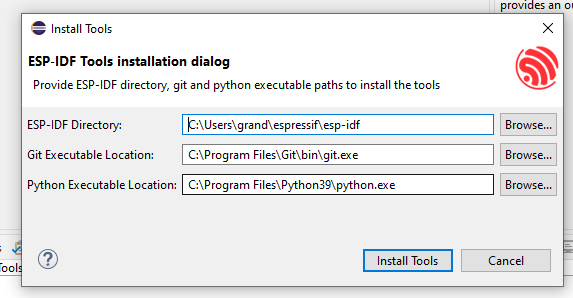

[Назад](./README.md)

# Eclipse <div id="espidflinuxeclipseplugin"></div>

1. Скачиваем установщик *Eclipse* с https://www.eclipse.org/downloads/. Важно! Должна быть установлена *Oracle Java*: https://www.oracle.com/ru/java/technologies/javase-jre8-downloads.html

2. Кладём установщик в каталог ```~/IDE/eclipse```. Его можно будет запускать повторно и в средах *GNOME*, *KDE*, *XFCE*, *MATE*, установщик создаст нужные скрипты запуска.

3. Если справа сверху на иконке «бургера» появится восклицательный знак, обновляем установщик, чтобы он мог установить последние версии сборок *Eclipse*

4. Устанавливаем *Eclipse developing C/C++*


5. После запуска установленного *Eclipse*, идём в *Help->Market place*. В строке поиска выбираем **esp-idf**. Устанавливаем. Перезапускаем *Eclipse*. 


6. В меню *Help*, выбираем *Help->Download and configure ESP-IDF*. Далее, выбираем *Use an existing ESP-IDF directory from file system*. Указываем путь к установленному пакету **esp-idf**. В данном случае, это ```~/espressif/esp-idf```.


7. Появится окошко с путями к **esp-idf**, **git**, **python**. Если какой-либо путь не «подхватился», добавьте его вручную, используя в консоли команду ```which```, например, ```which git```, ```which python``` и т.д.





8. После перезапуска выбираем *File->Project*. В диалоговом окне выбираем *Espressif->Espressif IDF Project*. *Next*. Если далее выбрать *«Next»*, появится окно с выбором шаблонного проекта из списка ```~/espressif/esp-idf/examples```. Самые простые проекты — «hello world», «blink», «sample_project». Можете выбрать любой.


9. Выбираем в поле «on», «Esp32». Нажимаем на шестерёнку и выбираем порт USB. Обычно, это ```/dev/ttyUSB0```. Нажимаем «Run». Если все прошло удачно, проект будет собран и прошит.


10. Нажимаем на иконку с монитором в верхнем тулбаре, указываем кодировку *UTF-8*, порт ```/dev/ttyUSB0```. Должен запуститься *IDF-monitor*. К сожалению, выход по **Ctrl+]** не работает. Когда в мониторе не будет необходимости, его надо просто закрыть.


[Назад](./README.md)
