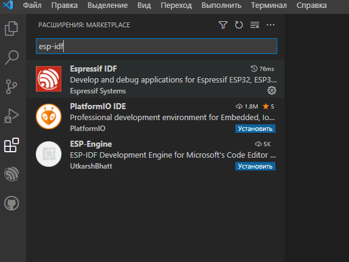
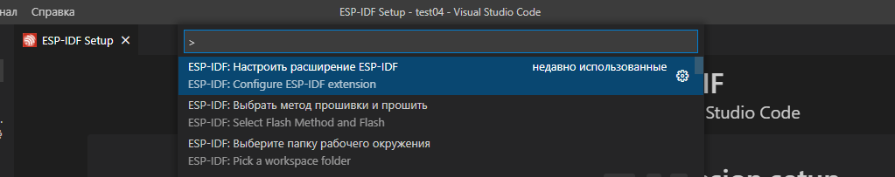

[Назад](./README.md)

##### VSCode <div id="espidflinuxvscodeplugin"></div>

1. Скачать *.tar.gz* архив *VSCode* с линка https://code.visualstudio.com/download
2. Создать каталог *~/IDE/*, скопировать туда архив и развернуть его ```tar -zxvf code-stable-x64-xxxxxxxxxxxx.tar.gz```
3. Создать мягкий линк ```ln -sf ~/IDE/VSCode-Linux-x64/bin/code ~/.local/bin``` именно из каталога *bin*, потому, что именно ```.../bin/code```, «отпускает» консоль после запуска.
4. Если Вы используете среду *GNOME*, заменить *${HOME}* в *vscode.desktop* и копировать ```cp vscode.desktop ~/.local/share/applications``` или в ```/usr/share/applications```, если Вы хотите чтобы Ваш *VSCode* был бы виден глобально.


Файл [vscode.desktop](./files/vscode.desctop) (${HOME} замените на путь к домашнему каталогу, например, ```/home/vasya```. ```desktop-file``` не понимает переменных окружения :-( )


```
[Desktop Entry]
Type=Application
Exec="${HOME}/IDE/VSCode-linux-x64/bin/code" %F
Name=VSCode
GenericName=The Microsoft IDE for C/C++, Javascript, Python e.t.c. development.
Icon=${HOME}/IDE/VSCode-linux-x64/resources/app/resources/linux/code.png
StartupWMClass=code
Terminal=false
Categories=Development;IDE;C/C++;Python;Java;Java Script;Node;NodeJS
MimeType=text/x-c++src;text/x-c++hdr;text/x-xsrc;application/x-designer;

```


5. Установить плагин *esp-idf* в *VSCode*





6. Запустить ```code .``` из консоли, где был запущен скрипт ```. ~/espressif/esp-idf/export.sh```, чтобы плагин смог «подхватить» переменные окружения и узнать, где установлен фреймворк и набор инструментов с *venv* python.
7. При помощи клавиши **F1** вызвать меню команд *VSCode* и найти **\>ESP-IDF: Настроить расширение EPS-IDF**



8. Если появился экран с возможностью выбора 

«USE EXISTING SETUP

We have found ESP-IDF version: 4.4 @/home/grandfatherpikhto/espressif/esp-idf and ESP-IDF tools in @ /home/grandfatherpikhto/.espressif. Click here to use them.»

Всё в порядке. Выбираем «USE EXISTING SETUP»


9. Если установка прошла удачно, жмём **Ctrl + E N**. Если нет, **F1 -> \>ESP-IDF: Команда врача** вставляем содержимое **Ctrl+V** в новый файл ищем, что не так. Выбираем какой-нибудь шаблон приложения. Например, «template-app» — Hello World).


Или Вы можете выбрать **Ctrl+E: C** — создать проект из шаблона расширения (т.е., из одного из примеров из ```%USERPROFILE%/espressif/esp-idf/examples```)


Или можно выбрать «\>ESP-IDF: Показать проекты примеров» и создать проект из выбранного примера:


10. Если всё прошло удачно (будьте внимательны, каталог, в котором создаётся новый проект должен существовать, иначе, будет сообщение об ошибке) соглашаемся открыть новое окно.


11. Пытаемся собрать проект. Иногда, после первого запуска случается так, что проект не собирается из-за того, что не хватает привилегий. С чем это связано, не знаю, но надо просто перезапустить *VSCode*


12. Запускаем сборку, прошивку и мониторинг проекта — **Ctrl+E D**. Обратите внимание: сверху может появиться выбор способа прошивки проекта: **UART/JTAG**. Выбираем **UART**.


13. Если всё прошло удачно, запустится мониторинг проекта с отображений журнала сообщений от процессора **ESP32**, передаваемых через **USB**.


[Назад](./README.md)
