[Назад](./README.md)

# Eclipse

1. Устанавливаем *Oracle Java*. https://www.oracle.com/ru/java/technologies/javase-jdk16-downloads.html

2. Скачиваем *Eclipse installer*. https://www.eclipse.org/downloads/

3. Запускаем установщик, если справа сверху в бургере появился восклицательный знак, обновляем установщик.

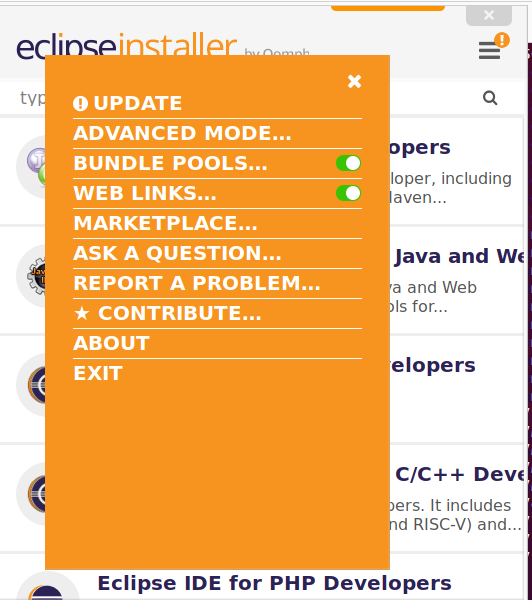


4. После обновления запускаем установку «Eclipse IDE for C/C++ Developers». В принципе, было бы неплохо создать ярлык eclipse на рабочем столе, потому, что локальный установщик *Eclipse* не создаёт в меню «Пуск» иконки для *Eclipse*. Обычно *Eclipse* устанавливается в %USERPROFILE\eclipse\cpp-latest-released\eclipse%. 

5. После установки, «Help->Eclipse Marketlace», ищем «esp-idf». Устанавливаем. После перезагрузки «Help->Download and Configure ESP-IDF». Выбрать «Ues an existing ESP-IDF directory from file system»

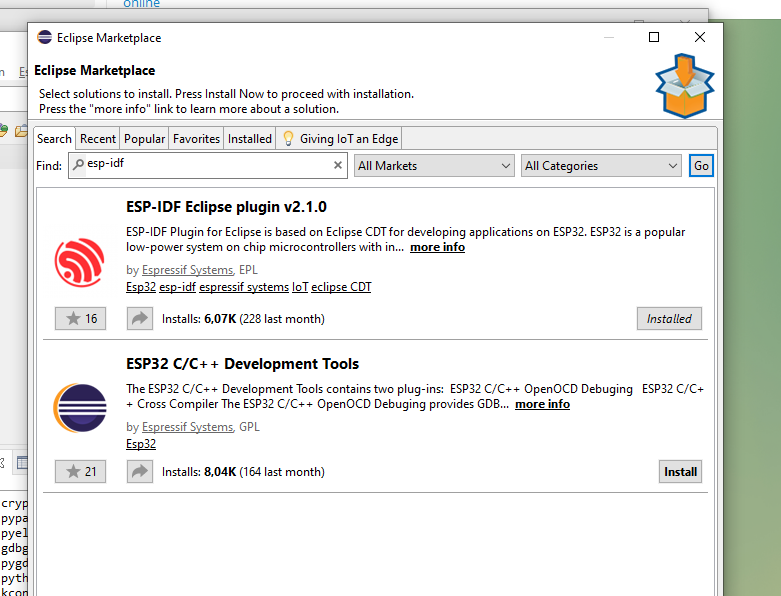


Скорее всего, *esp-idf* установлен в ```~/espressif/esp-idf```, *git* в ```/usr/bin/git```, *python*, в ```/usr/bin/python3```, но лучше создать для него алиас ```alias python=/usr/bin/python3``` или мягкую ссылку в локальный каталог bin: ```ln -sf /usr/bin/python3 ~/.local/bin/python```. 

Если всё идёт, как надо, увидим примерно следующее:

```
Installing tools...
This can take a while. Please be patient.
......
Install tools completed.
```

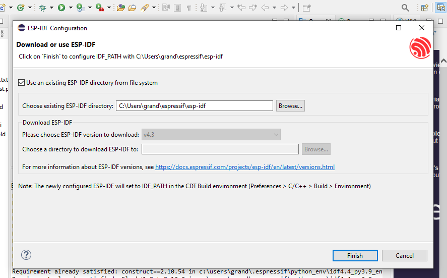


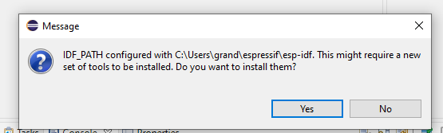


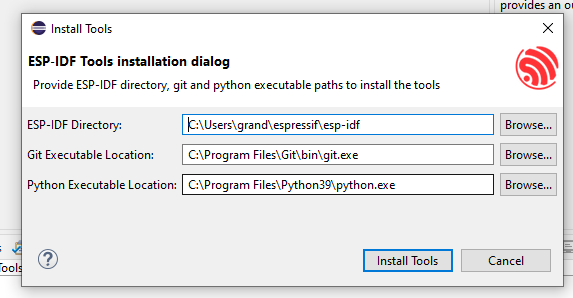


6.  Если установка прошла успешно, после установки вызываем «File->New Project». «Espressif IDF Project». В отличие от *VSCode*, *Eclipse* создаёт новый проект, используя один из примеров, находящихся в каталоге *~/espressif/esp-idf/examples*. Самое простое использовать «Hello World».


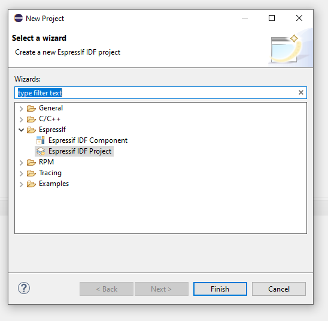


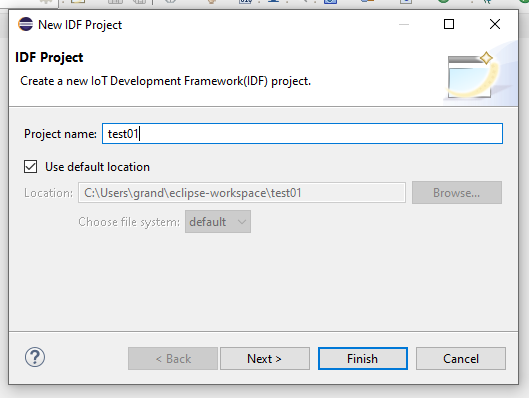


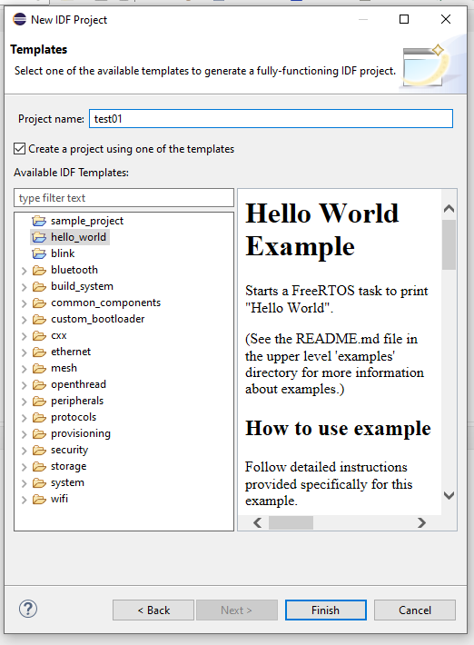


22. Не забудьте выставить в тулбаре *ESP-IDF* в выпадающем списке «on», «esp32», потому что у вас скорее всего, обычная *ESP32*. Нажмите на шестерёнку и выберите порт прошивки: «COM3»,  «COM5»,  «COM7»,  ... и так далее.

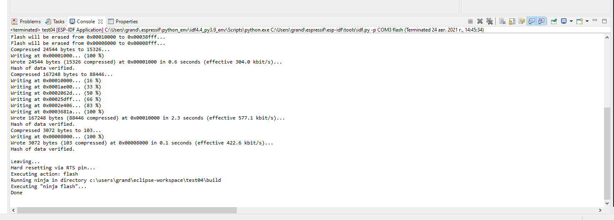


23. Нажимаем кнопку «Run», собираем и прошиваем проект. Чтобы запустить ESP-IDF Monitor, нажимаем на панели ESP-IDF значок монитора, выбираем порт и кодировку UTF-8. Наблюдаем сообщения журнала esp32


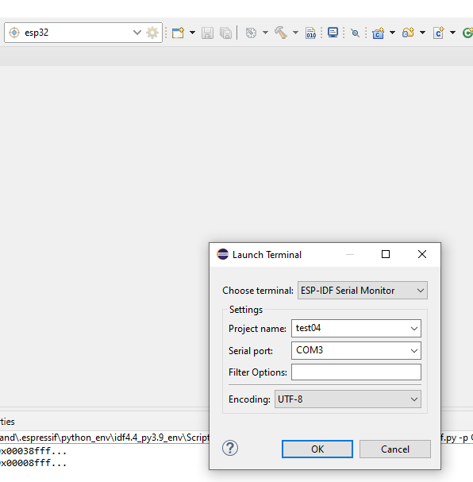


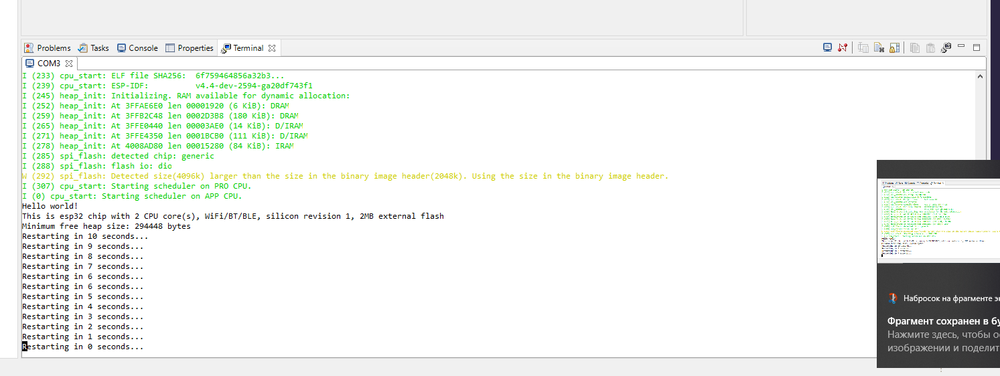


На этом, всё!


[Назад](./README.md)
