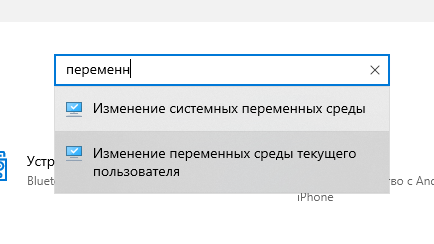
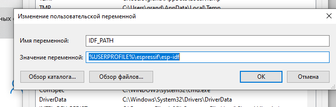
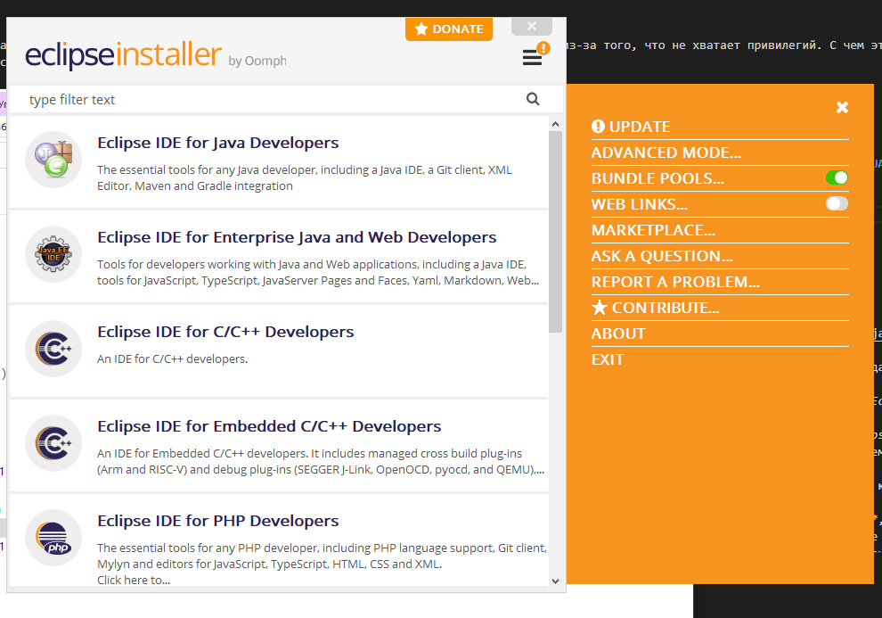

##### VSCode

8. Убедившись, что пример работает, запускаем из главного меню «Параметры» через поиск «Изменение переменных среды текущего пользователя». Причём, именно, текущего пользователя, если мы не хотим, чтобы все остальные видели эти переменные. Добавляем **IDF_PATH** со значением ```%USERPROFILE%/espressif/esp-idf```. Это нужно для установки плагина ```esp-idf``` на *VSCode*. В принципе, можно добавить **IDF_PYTHON_ENV_PATH** с указанием пути к *Python Virtual Environment*. На момент настройки, *venv* находится в каталоге ```%USERPROFILE%\.espressif\python_env\idf4.4_py3.9_env```. Понятно, что с изменением версии **esp-idf** и версии **python** путь к каталогу изменится. Также, можно добавить **IDF_TOOLS_PATH**. Имеется в виду путь к инструментарию **idf**. Обычно инструментарий устанавливается в каталог ```%USERPROFILE%\.espressif```







9. Теперь, когда всё настроено, можно приступить к установке и настройке *VSCode*: https://code.visualstudio.com/download. Выбираем «User installer», если не хотим чтобы *VSCode* был установлен для всех пользователей компьютера. «User installer» установит *VSCode* в каталог ```%USERPROFILE%```. «System installer» установит программу в ```%ProgramFiles%``` (Обычно, ```C:\Program Files```)

10. Устанавливаем плагин **esp-idf**. После перезагрузки нажимаем **F1** и ищем *\>ESP_IDF: Настроить расширение ESP-IDF*. Если всё прошло удачно, видим «USE EXISTING SETUP». Если нет, идём в «*\>ESP-IDF: Команда врача*» и исследуем скопированный в буффер отчёт (Создать новый файл **Ctrl+N**, вставить содержимое буффера **Shift+Ins** и читать, пока не станет понятно, в чём именно дело)


11. Если видим «IDF-Extension for Visual Studio Code. All settings have been configured. You can close this window.», значит, настройка прошла удачно. 

12. Можно вызвать команду создания нового ESP-IDF проекта: **Ctrl+E N**. Выбираем имя и путь к новому проекту. Важно, чтобы путь *существовал*. Иначе, новый проект не будет создан. Выбираем шаблон для проекта. Самый простой — «template-app». Это пример «Hello World». Выбираем «Crete project using template-app». Если видим «Project ... has been created. Open project in new window?», значит, всё прошло удачно и можно нажать «Yes».


13. В новом окне пробуем собрать проект: «**Ctrl+E B**». Если всё прошло хорошо, можно запустить прошивку проекта: **F1**, «\>ESP-IDF: Выбрать метод прошивки и прошить» (Команда **Ctrl+E F** на этот момент заглючила)


14. Полный список команд здесь: https://github.com/espressif/vscode-esp-idf-extension#Available-commands

15. Команда **Ctrl+E M** запустит монитор, выход из него, как обычно **Ctrl+]**.

#### Eclipse

16. Устанавливаем *Oracle Java*. https://www.oracle.com/ru/java/technologies/javase-jdk16-downloads.html

17. Скачиваем *Eclipse installer*. https://www.eclipse.org/downloads/

18. Запускаем установщик, если справа сверху в бургере появился восклицательный знак, обновляем установщик.




19. После обновления запускаем установку «Eclipse IDE for C/C++ Developers». В принципе, было бы неплохо создать ярлык eclipse на рабочем столе, потому, что локальный установщик *Eclipse* не создаёт в меню «Пуск» иконки для *Eclipse*. Обычно *Eclipse* устанавливается в %USERPROFILE\eclipse\cpp-latest-released\eclipse%. 

20. После установки, «Help->Eclipse Marketlace», ищем «esp-idf». Устанавливаем. После перезагрузки «Help->Download and Configure ESP-IDF». Выбрать «Ues an existing ESP-IDF directory from file system»


Скорее всего, *esp-idf* установлен в ```%USERPROFILE\espressif\esp-idf```, *git* в ```%ProgramFiles\git\bin```, *python*, в ```%ProgramFiles\python39```. 
Если всё идёт, как надо, увидим примерно следующее:

```
Installing tools...
This can take a while. Please be patient.
......
Install tools completed.
```


21. Если установка прошла успешно, после установки вызываем «File->New Project». «Espressif IDF Project». В отличие от *VSCode*, *Eclipse* создаёт новый проект, используя один из примеров, находящихся в каталоге *%USERPROFILE%\espressif\esp-idf\examples*. Самое простое использовать «Hello World».


22. Не забудьте выставить в тулбаре *ESP-IDF* в выпадающем списке «on», «esp32», потому что у вас скорее всего, обычная *ESP32*. Нажмите на шестерёнку и выберите порт прошивки: «COM3»,  «COM5»,  «COM7»,  ... и так далее.


23. Нажимаем кнопку «Run», собираем и прошиваем проект. Чтобы запустить ESP-IDF Monitor, нажимаем на панели ESP-IDF значок монитора, выбираем порт и кодировку UTF-8. Наблюдаем сообщения журнала esp32


На этом, всё!


