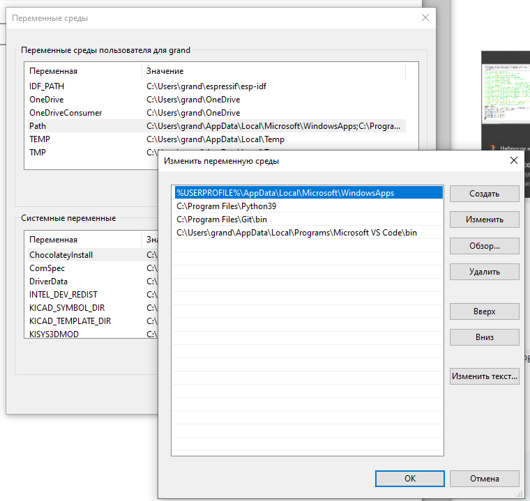

[Назад](./README.md)

- [Установка и настройка программ, необходимых для работы инструментария **esp-idf**](#install)
- [Клонирование репозитория **esp-idf**](#clone)
- [Установка инструментария](#toolchain)
- [Создание ярлыков запуска для cmd.exe и PowerShell](#shotcut)
- [Копирование проекта 'hello_world', сборка, прошивка и мониторинг](#idf)
- [Внесение минимальных изменений в проект](#edit)

1. <div id="install"></div>Устанавливаем **git**: https://git-scm.com/download/win, **python**: https://www.python.org/downloads/. **cmake** и **ninja** можно не устанавливаеть, Windows-инсталлятор инструментария сам «подтянет» нужные версии пакетов.

Не забываем добавить в **Path** пути к ```git``` и ```python```(На момент написания этой заметки, актуален Python3.9. Может быть установлено и другое окружение). Для этого вызываем из главного меню «Настройки», через поиск находим «Изменение переменных среды текущего пользователя». Находим переменную **Path** и добавляем туда ```C:\Program Files\Git\bin```, ```C:\Program Files\Python39``` 

Нажмём на кнопку «Пуск» и вызовем «Настройки» (шестерёнка)


Двойным щелчком откроем редактирование **Path**



В строке поиска вводим слово «переменных» и видим «Настройка переменных окружения пользователя». Кликаем. Добавляем нужные переменные. Проверяем, добавлены ли в 


2. <div id="clone"></div>Запускаем Командную Строку. Создадим каталог, куда будем скачивать фреймворки/фреймворк. Дело в том, что фреймворков Espressif, как минимум, три:
   
   ESP-IDF — Espressif IoT Development Framework — https://github.com/espressif/esp-idf
   
   ESP-ADF — Espressif Audio Development Framework — https://github.com/espressif/esp-adf
   
   ESP-MDF — Espressif Mesh Development Framework — https://github.com/espressif/esp-mdf

Не забываем клонировать нужный фреймворк с ключём *--recursive*, чтобы скачались связанные проекты. В принципе, не страшно, если вы его забудете. При запуске скрипта *install* нужные проекты докачаются.

3. <div id="toolchain"></div>Установим инструментарий. Если мы запустили ```cmd.exe``` (Командную строку, то)

```
cd %USERPROFILE%
mkdir espressif
cd .\espressif
git clone https://github.com/espressif/esp-idf.git --recursive
cd .\esp-idf\
.\install.bat
```

Если запустили ```PowerShell```, 

```
cd $env:USERPROFILE
mkdir espressif
git clone https://github.com/espressif/esp-idf.git --recursive
cd .\esp-idf\
.\install.ps1
```

Правда, в ```PowerShell``` могут возникнуть проблемы правами на запуск. Тогда читаем https://docs.microsoft.com/en-us/powershell/module/microsoft.powershell.security/set-executionpolicy?view=powershell-7.1. 

Самое простое, что можно сделать, установить разрешения на данную сессию:

```
Set-ExecutionPolicy -ExecutionPolicy AllSigned -Scope Process

Scope ExecutionPolicy
        ----- ---------------
MachinePolicy       Undefined
   UserPolicy       Undefined
      Process       AllSigned
  CurrentUser    RemoteSigned
 LocalMachine    RemoteSigned
```

Если всё пошло удачно, видим что-то вроде:

<details>
<summary>Журнал клонирования репозитория https://github.com/espressif/esp-idf</summary>
C:\Users\grand>mkdir espressif


C:\Users\grand>cd espressif


C:\Users\grand\espressif>git clone https://github.com/espressif/esp-idf.git --recursive

Cloning into 'esp-idf'...

remote: Enumerating objects: 265284, done.

remote: Counting objects: 100% (3872/3872), done.

remote: Compressing objects: 100% (1838/1838), done.

remote: Total 265284 (delta 1996), reused 3381 (delta 1866), pack-reused 261412 eceiving objects: 100% (265284/Receiving objects: 100% (265284/265284), 149.11 MiB | 9.44 MiB/s, done.


Resolving deltas: 100% (195585/195585), done.

Updating files: 100% (9189/9189), done.

Submodule 'components/asio/asio' (https://github.com/espressif/asio.git) registered for path 'components/asio/asio'

Submodule 'components/bootloader/subproject/components/micro-ecc/micro-ecc' (https://github.com/kmackay/micro-ecc.git) registered for path 'components/bootloader/subproject/components/micro-ecc/micro-ecc'

Submodule 'components/bt/controller/lib_esp32' (https://github.com/espressif/esp32-bt-lib.git) registered for path 'components/bt/controller/lib_esp32'

Submodule 'components/bt/controller/lib_esp32c3_family' (https://github.com/espressif/esp32c3-bt-lib.git) registered for path 'components/bt/controller/lib_esp32c3_family'

Submodule 'components/bt/host/nimble/nimble' (https://github.com/espressif/esp-nimble.git) registered for path 'components/bt/host/nimble/nimble'

Submodule 'components/cbor/tinycbor' (https://github.com/intel/tinycbor.git) registered for path 'components/cbor/tinycbor'

Submodule 'components/cmock/CMock' (https://github.com/ThrowTheSwitch/CMock.git) registered for path 'components/cmock/CMock'

Submodule 'components/coap/libcoap' (https://github.com/obgm/libcoap.git) registered for path 'components/coap/libcoap'

Submodule 'components/esp_phy/lib' (https://github.com/espressif/esp-phy-lib.git) registered for path 'components/esp_phy/lib'

Submodule 'components/esp_wifi/lib' (https://github.com/espressif/esp32-wifi-lib.git) registered for path 'components/esp_wifi/lib'

Submodule 'components/esptool_py/esptool' (https://github.com/espressif/esptool.git) registered for path 'components/esptool_py/esptool'

Submodule 'components/expat/expat' (https://github.com/libexpat/libexpat.git) registered for path 'components/expat/expat'

Submodule 'components/ieee802154/lib' (https://github.com/espressif/esp-ieee802154-lib.git) registered for path 'components/ieee802154/lib'

Submodule 'components/json/cJSON' (https://github.com/DaveGamble/cJSON.git) registered for path 'components/json/cJSON'

Submodule 'components/libsodium/libsodium' (https://github.com/jedisct1/libsodium.git) registered for path 'components/libsodium/libsodium'

Submodule 'components/lwip/lwip' (https://github.com/espressif/esp-lwip.git) registered for path 'components/lwip/lwip'

Submodule 'components/mbedtls/mbedtls' (https://github.com/espressif/mbedtls.git) registered for path 'components/mbedtls/mbedtls'

Submodule 'components/mqtt/esp-mqtt' (https://github.com/espressif/esp-mqtt.git) registered for path 'components/mqtt/esp-mqtt'

Submodule 'components/nghttp/nghttp2' (https://github.com/nghttp2/nghttp2.git) registered for path 'components/nghttp/nghttp2'

Submodule 'components/openthread/lib' (https://github.com/espressif/esp-thread-lib.git) registered for path 'components/openthread/lib'

Submodule 'components/openthread/openthread' (https://github.com/espressif/openthread.git) registered for path 'components/openthread/openthread'

Submodule 'components/protobuf-c/protobuf-c' (https://github.com/protobuf-c/protobuf-c.git) registered for path 'components/protobuf-c/protobuf-c'

Submodule 'components/spiffs/spiffs' (https://github.com/pellepl/spiffs.git) registered for path 'components/spiffs/spiffs'

Submodule 'components/tinyusb/tinyusb' (https://github.com/espressif/tinyusb.git) registered for path 'components/tinyusb/tinyusb'

Submodule 'components/unity/unity' (https://github.com/ThrowTheSwitch/Unity.git) registered for path 'components/unity/unity'

Submodule 'examples/build_system/cmake/import_lib/main/lib/tinyxml2' (https://github.com/leethomason/tinyxml2.git) registered for path 'examples/build_system/cmake/import_lib/main/lib/tinyxml2'

Submodule 'examples/peripherals/secure_element/atecc608_ecdsa/components/esp-cryptoauthlib' (https://github.com/espressif/esp-cryptoauthlib.git) registered for path 'examples/peripherals/secure_element/atecc608_ecdsa/components/esp-cryptoauthlib'

Cloning into 'C:/Users/grand/espressif/esp-idf/components/asio/asio'...

remote: Enumerating objects: 48394, done.

remote: Counting objects: 100% (15174/15174), done.

remote: Compressing objects: 100% (1324/1324), done.

remote: Total 48394 (delta 14750), reused 13850 (delta 13850), pack-reused 33220

Receiving objects: 100% (48394/48394), 15.04 MiB | 6.38 MiB/s, done.

Resolving deltas: 100% (33906/33906), done.

Cloning into 'C:/Users/grand/espressif/esp-idf/components/bootloader/subproject/components/micro-ecc/micro-ecc'...

remote: Enumerating objects: 1143, done.

remote: Counting objects: 100% (48/48), done.

remote: Compressing objects: 100% (37/37), done.

remote: Total 1143 (delta 21), reused 28 (delta 9), pack-reused 1095

Receiving objects: 100% (1143/1143), 687.07 KiB | 2.99 MiB/s, done.

Resolving deltas: 100% (664/664), done.

Cloning into 'C:/Users/grand/espressif/esp-idf/components/bt/controller/lib_esp32'...

remote: Enumerating objects: 1547, done.

remote: Counting objects: 100% (667/667), done.

remote: Compressing objects: 100% (363/363), done.

remote: Total 1547 (delta 427), reused 525 (delta 285), pack-reused 880

Receiving objects: 100% (1547/1547), 6.13 MiB | 8.36 MiB/s, done.

Resolving deltas: 100% (1025/1025), done.

Cloning into 'C:/Users/grand/espressif/esp-idf/components/bt/controller/lib_esp32c3_family'...

remote: Enumerating objects: 107, done.

remote: Counting objects: 100% (107/107), done.

remote: Compressing objects: 100% (69/69), done.

remote: Total 107 (delta 46), reused 86 (delta 25), pack-reused 0

Receiving objects: 100% (107/107), 383.46 KiB | 2.15 MiB/s, done.

Resolving deltas: 100% (46/46), done.

Cloning into 'C:/Users/grand/espressif/esp-idf/components/bt/host/nimble/nimble'...

remote: Enumerating objects: 40824, done.

remote: Counting objects: 100% (380/380), done.

remote: Compressing objects: 100% (141/141), done.

remote: Total 40824 (delta 261), reused 337 (delta 234), pack-reused 40444

Receiving objects: 100% (40824/40824), 11.91 MiB | 9.57 MiB/s, done.

Resolving deltas: 100% (24989/24989), done.

Cloning into 'C:/Users/grand/espressif/esp-idf/components/cbor/tinycbor'...

remote: Enumerating objects: 2797, done.

remote: Counting objects: 100% (27/27), done.

remote: Compressing objects: 100% (19/19), done.

remote: Total 2797 (delta 12), reused 17 (delta 8), pack-reused 2770

Receiving objects: 100% (2797/2797), 1.30 MiB | 4.64 MiB/s, done.

Resolving deltas: 100% (1888/1888), done.

Cloning into 'C:/Users/grand/espressif/esp-idf/components/cmock/CMock'...

remote: Enumerating objects: 5719, done.

remote: Counting objects: 100% (108/108), done.

remote: Compressing objects: 100% (73/73), done.

remote: Total 5719 (delta 52), reused 61 (delta 25), pack-reused 5611

Receiving objects: 100% (5719/5719), 3.60 MiB | 6.36 MiB/s, done.

Resolving deltas: 100% (3881/3881), done.

Cloning into 'C:/Users/grand/espressif/esp-idf/components/coap/libcoap'...

remote: Enumerating objects: 12280, done.

remote: Counting objects: 100% (1351/1351), done.

remote: Compressing objects: 100% (442/442), done.

remote: Total 12280 (delta 888), reused 1218 (delta 853), pack-reused 10929

Receiving objects: 100% (12280/12280), 5.46 MiB | 5.15 MiB/s, done.

Resolving deltas: 100% (8697/8697), done.

Cloning into 'C:/Users/grand/espressif/esp-idf/components/esp_phy/lib'...

remote: Enumerating objects: 45, done.

remote: Counting objects: 100% (45/45), done.

remote: Compressing objects: 100% (38/38), done.

remote: Total 45 (delta 9), reused 42 (delta 6), pack-reused 0

Receiving objects: 100% (45/45), 687.79 KiB | 2.58 MiB/s, done.

Resolving deltas: 100% (9/9), done.

Cloning into 'C:/Users/grand/espressif/esp-idf/components/esp_wifi/lib'...

remote: Enumerating objects: 15182, done.

remote: Counting objects: 100% (2927/2927), done.

remote: Compressing objects: 100% (598/598), done.

remote: Total 15182 (delta 2362), reused 2892 (delta 2329), pack-reused 12255

Receiving objects: 100% (15182/15182), 174.46 MiB | 10.41 MiB/s, done.

Resolving deltas: 100% (12417/12417), done.

Cloning into 'C:/Users/grand/espressif/esp-idf/components/esptool_py/esptool'...

remote: Enumerating objects: 3410, done.

remote: Counting objects: 100% (447/447), done.

remote: Compressing objects: 100% (248/248), done.

remote: Total 3410 (delta 268), reused 338 (delta 197), pack-reused 2963

Receiving objects: 100% (3410/3410), 10.72 MiB | 9.78 MiB/s, done.

Resolving deltas: 100% (2138/2138), done.

Cloning into 'C:/Users/grand/espressif/esp-idf/components/expat/expat'...

remote: Enumerating objects: 17563, done.

remote: Counting objects: 100% (873/873), done.

remote: Compressing objects: 100% (334/334), done.

remote: Total 17563 (delta 591), reused 762 (delta 532), pack-reused 16690

Receiving objects: 100% (17563/17563), 14.44 MiB | 10.06 MiB/s, done.

Resolving deltas: 100% (13067/13067), done.

Cloning into 'C:/Users/grand/espressif/esp-idf/components/ieee802154/lib'...

remote: Enumerating objects: 22, done.

remote: Counting objects: 100% (22/22), done.

remote: Compressing objects: 100% (15/15), done.

remote: Total 22 (delta 6), reused 20 (delta 4), pack-reused 0

Receiving objects: 100% (22/22), 54.74 KiB | 1.33 MiB/s, done.

Resolving deltas: 100% (6/6), done.

Cloning into 'C:/Users/grand/espressif/esp-idf/components/json/cJSON'...

remote: Enumerating objects: 4498, done.

remote: Counting objects: 100% (16/16), done.

remote: Compressing objects: 100% (16/16), done.

remote: Total 4498 (delta 4), reused 7 (delta 0), pack-reused 4482

Receiving objects: 100% (4498/4498), 2.46 MiB | 6.42 MiB/s, done.

Resolving deltas: 100% (2988/2988), done.

Cloning into 'C:/Users/grand/espressif/esp-idf/components/libsodium/libsodium'...

remote: Enumerating objects: 32905, done.

remote: Counting objects: 100% (512/512), done.

remote: Compressing objects: 100% (266/266), done.

remote: Total 32905 (delta 260), reused 448 (delta 235), pack-reused 32393

Receiving objects: 100% (32905/32905), 8.66 MiB | 4.26 MiB/s, done.

Resolving deltas: 100% (19517/19517), done.

Cloning into 'C:/Users/grand/espressif/esp-idf/components/lwip/lwip'...

remote: Enumerating objects: 50119, done.

remote: Counting objects: 100% (153/153), done.

remote: Compressing objects: 100% (101/101), done.

remote: Total 50119 (delta 90), reused 92 (delta 51), pack-reused 49966

Receiving objects: 100% (50119/50119), 9.93 MiB | 8.79 MiB/s, done.

Resolving deltas: 100% (37831/37831), done.

Cloning into 'C:/Users/grand/espressif/esp-idf/components/mbedtls/mbedtls'...

remote: Enumerating objects: 77211, done.

remote: Total 77211 (delta 0), reused 0 (delta 0), pack-reused 77211

Receiving objects: 100% (77211/77211), 34.91 MiB | 9.96 MiB/s, done.

Resolving deltas: 100% (59486/59486), done.

Cloning into 'C:/Users/grand/espressif/esp-idf/components/mqtt/esp-mqtt'...

remote: Enumerating objects: 2558, done.

remote: Counting objects: 100% (268/268), done.

remote: Compressing objects: 100% (148/148), done.

remote: Total 2558 (delta 147), reused 234 (delta 115), pack-reused 2290

Receiving objects: 100% (2558/2558), 1.53 MiB | 5.54 MiB/s, done.

Resolving deltas: 100% (1378/1378), done.

Cloning into 'C:/Users/grand/espressif/esp-idf/components/nghttp/nghttp2'...

remote: Enumerating objects: 41726, done.

remote: Counting objects: 100% (1000/1000), done.

remote: Compressing objects: 100% (372/372), done.

remote: Total 41726 (delta 652), reused 941 (delta 624), pack-reused 40726

Receiving objects: 100% (41726/41726), 34.54 MiB | 10.69 MiB/s, done.

Resolving deltas: 100% (30992/30992), done.

Cloning into 'C:/Users/grand/espressif/esp-idf/components/openthread/lib'...

remote: Enumerating objects: 143, done.

remote: Counting objects: 100% (143/143), done.

remote: Compressing objects: 100% (78/78), done.

remote: Total 143 (delta 74), reused 127 (delta 58), pack-reused 0

Receiving objects: 100% (143/143), 2.61 MiB | 6.90 MiB/s, done.

Resolving deltas: 100% (74/74), done.

Cloning into 'C:/Users/grand/espressif/esp-idf/components/openthread/openthread'...

remote: Enumerating objects: 83554, done.

remote: Counting objects: 100% (63/63), done.

remote: Compressing objects: 100% (39/39), done.

remote: Total 83554 (delta 24), reused 34 (delta 24), pack-reused 83491

Receiving objects: 100% (83554/83554), 82.49 MiB | 7.31 MiB/s, done.

Resolving deltas: 100% (65311/65311), done.

Cloning into 'C:/Users/grand/espressif/esp-idf/components/protobuf-c/protobuf-c'...

remote: Enumerating objects: 3650, done.

remote: Counting objects: 100% (117/117), done.

remote: Compressing objects: 100% (81/81), done.

remote: Total 3650 (delta 59), reused 71 (delta 31), pack-reused 3533

Receiving objects: 100% (3650/3650), 1.49 MiB | 5.17 MiB/s, done.

Resolving deltas: 100% (2326/2326), done.

Cloning into 'C:/Users/grand/espressif/esp-idf/components/spiffs/spiffs'...

remote: Enumerating objects: 1502, done.

remote: Counting objects: 100% (19/19), done.

remote: Compressing objects: 100% (14/14), done.

remote: Total 1502 (delta 7), reused 12 (delta 5), pack-reused 1483

Receiving objects: 100% (1502/1502), 1.06 MiB | 4.16 MiB/s, done.

Resolving deltas: 100% (1042/1042), done.

Cloning into 'C:/Users/grand/espressif/esp-idf/components/tinyusb/tinyusb'...

remote: Enumerating objects: 49097, done.

remote: Counting objects: 100% (1406/1406), done.

remote: Compressing objects: 100% (638/638), done.

remote: Total 49097 (delta 759), reused 1254 (delta 721), pack-reused 47691

Receiving objects: 100% (49097/49097), 26.61 MiB | 9.96 MiB/s, done.

Resolving deltas: 100% (32404/32404), done.

Cloning into 'C:/Users/grand/espressif/esp-idf/components/unity/unity'...

remote: Enumerating objects: 5865, done.

remote: Counting objects: 100% (88/88), done.

remote: Compressing objects: 100% (56/56), done.

remote: Total 5865 (delta 43), reused 69 (delta 32), pack-reused 5777

Receiving objects: 100% (5865/5865), 6.62 MiB | 8.83 MiB/s, done.

Resolving deltas: 100% (3627/3627), done.

Cloning into 'C:/Users/grand/espressif/esp-idf/examples/build_system/cmake/import_lib/main/lib/tinyxml2'...

remote: Enumerating objects: 4456, done.

remote: Counting objects: 100% (303/303), done.

remote: Compressing objects: 100% (145/145), done.

remote: Total 4456 (delta 229), reused 188 (delta 158), pack-reused 4153

Receiving objects: 100% (4456/4456), 3.20 MiB | 6.69 MiB/s, done.

Resolving deltas: 100% (2961/2961), done.

Cloning into 'C:/Users/grand/espressif/esp-idf/examples/peripherals/secure_element/atecc608_ecdsa/components/esp-cryptoauthlib'...

remote: Enumerating objects: 596, done.

remote: Counting objects: 100% (596/596), done.

remote: Compressing objects: 100% (303/303), done.

remote: Total 596 (delta 325), reused 553 (delta 282), pack-reused 0

Receiving objects: 100% (596/596), 905.33 KiB | 3.80 MiB/s, done.

Resolving deltas: 100% (325/325), done.

Submodule path 'components/asio/asio': checked out 'f31694c9f1746ba189a4bcae2e34db15135ddb22'

Submodule path 'components/bootloader/subproject/components/micro-ecc/micro-ecc': checked out 'd037ec89546fad14b5c4d5456c2e23a71e554966'

Submodule path 'components/bt/controller/lib_esp32': checked out 'fb49791b7c1a8a35f06e68124c90022667b4cff1'

Submodule path 'components/bt/controller/lib_esp32c3_family': checked out '9ca8afd50afde57958a67fca65847edc52f7d91c'

Submodule path 'components/bt/host/nimble/nimble': checked out 'aef55bbf636ed580d4d6408a5c2e75d1f70a875e'

Submodule path 'components/cbor/tinycbor': checked out '7c349dbb6b8d76db39383b226d3ebdf59b8ab37d'

Submodule path 'components/cmock/CMock': checked out 'eeecc49ce8af123cf8ad40efdb9673e37b56230f'

Submodule 'vendor/c_exception' (https://github.com/throwtheswitch/cexception.git) registered for path 'components/cmock/CMock/vendor/c_exception'

Submodule 'vendor/unity' (https://github.com/throwtheswitch/unity.git) registered for path 'components/cmock/CMock/vendor/unity'

Cloning into 'C:/Users/grand/espressif/esp-idf/components/cmock/CMock/vendor/c_exception'...

remote: Enumerating objects: 326, done.

remote: Counting objects: 100% (61/61), done.

remote: Compressing objects: 100% (47/47), done.

remote: Total 326 (delta 23), reused 34 (delta 9), pack-reused 265

Receiving objects: 100% (326/326), 547.04 KiB | 2.62 MiB/s, done.

Resolving deltas: 100% (150/150), done.

Cloning into 'C:/Users/grand/espressif/esp-idf/components/cmock/CMock/vendor/unity'...

remote: Enumerating objects: 5865, done.

remote: Counting objects: 100% (88/88), done.

remote: Compressing objects: 100% (56/56), done.

remote: Total 5865 (delta 43), reused 69 (delta 32), pack-reused 5777

Receiving objects: 100% (5865/5865), 6.62 MiB | 8.66 MiB/s, done.

Resolving deltas: 100% (3627/3627), done.

Submodule path 'components/cmock/CMock/vendor/c_exception': checked out '71b47be7c950f1bf5f7e5303779fa99a16224bb6'

Submodule path 'components/cmock/CMock/vendor/unity': checked out 'cf949f45ca6d172a177b00da21310607b97bc7a7'

Submodule path 'components/coap/libcoap': checked out '98954eb30a2e728e172a6cd29430ae5bc999b585'

Submodule 'ext/tinydtls' (https://github.com/eclipse/tinydtls.git) registered for path 'components/coap/libcoap/ext/tinydtls'

Cloning into 'C:/Users/grand/espressif/esp-idf/components/coap/libcoap/ext/tinydtls'...

remote: Enumerating objects: 3360, done.

remote: Counting objects: 100% (789/789), done.

remote: Compressing objects: 100% (120/120), done.

remote: Total 3360 (delta 686), reused 670 (delta 669), pack-reused 2571

Receiving objects: 100% (3360/3360), 987.43 KiB | 4.06 MiB/s, done.

Resolving deltas: 100% (2397/2397), done.

Submodule path 'components/coap/libcoap/ext/tinydtls': checked out '7f8c86e501e690301630029fa9bae22424adf618'

Submodule path 'components/esp_phy/lib': checked out '8b1137c35cc3d2b1085e7f857c2530efb115d3a3'

Submodule path 'components/esp_wifi/lib': checked out '492bb8b01b6ccff1e830b52c7b15d8c3d90101c6'

Submodule path 'components/esptool_py/esptool': checked out '9876dfe58353f01c873e1543dd0654c5b04314a4'

Submodule path 'components/expat/expat': checked out 'a28238bdeebc087071777001245df1876a11f5ee'

Submodule path 'components/ieee802154/lib': checked out 'efbc05d641040253567e825dae53731da595c7b5'

Submodule path 'components/json/cJSON': checked out 'd2735278ed1c2e4556f53a7a782063b31331dbf7'

Submodule path 'components/libsodium/libsodium': checked out '4f5e89fa84ce1d178a6765b8b46f2b6f91216677'

Submodule path 'components/lwip/lwip': checked out '2195f7416fb3136831babf3e96c027a73075bd4f'

Submodule path 'components/mbedtls/mbedtls': checked out '6465247f67167518b8813ae2faaf422704e4b1a3'

Submodule path 'components/mqtt/esp-mqtt': checked out 'f10321a53b53a146ee299cfecc320b89c0cf6611'

Submodule path 'components/nghttp/nghttp2': checked out '8f7b008b158e12de0e58247afd170f127dbb6456'

Submodule 'third-party/mruby' (https://github.com/mruby/mruby) registered for path 'components/nghttp/nghttp2/third-party/mruby'

Submodule 'third-party/neverbleed' (https://github.com/tatsuhiro-t/neverbleed.git) registered for path 'components/nghttp/nghttp2/third-party/neverbleed'

Cloning into 'C:/Users/grand/espressif/esp-idf/components/nghttp/nghttp2/third-party/mruby'...

remote: Enumerating objects: 65288, done.

remote: Counting objects: 100% (865/865), done.

remote: Compressing objects: 100% (344/344), done.

remote: Total 65288 (delta 484), reused 836 (delta 478), pack-reused 64423

Receiving objects: 100% (65288/65288), 17.61 MiB | 8.70 MiB/s, done.

Resolving deltas: 100% (40866/40866), done.

Cloning into 'C:/Users/grand/espressif/esp-idf/components/nghttp/nghttp2/third-party/neverbleed'...

remote: Enumerating objects: 234, done.

remote: Total 234 (delta 0), reused 0 (delta 0), pack-reused 234

Receiving objects: 100% (234/234), 83.16 KiB | 703.00 KiB/s, done.

Resolving deltas: 100% (144/144), done.

Submodule path 'components/nghttp/nghttp2/third-party/mruby': checked out '7c91efc1ffda769a5f1a872c646c82b00698f1b8'

Submodule path 'components/nghttp/nghttp2/third-party/neverbleed': checked out 'b967ca054f48a36f82d8fcdd32e54ec5144f2751'

Submodule path 'components/openthread/lib': checked out '105f3610d2258d7a7dd1c72f5f1adea89077c6cc'

Submodule path 'components/openthread/openthread': checked out 'a662c32eb074cc624bf344f810f65f8637a89552'

Submodule path 'components/protobuf-c/protobuf-c': checked out 'dac1a65feac4ad72f612aab99f487056fbcf5c1a'

Submodule path 'components/spiffs/spiffs': checked out 'f5e26c4e933189593a71c6b82cda381a7b21e41c'

Submodule path 'components/tinyusb/tinyusb': checked out 'c4badd394eda18199c0196ed0be1e2d635f0a5f6'

Submodule path 'components/unity/unity': checked out '7d2bf62b7e6afaf38153041a9d53c21aeeca9a25'

Submodule path 'examples/build_system/cmake/import_lib/main/lib/tinyxml2': checked out '7e8e249990ec491ec15990cf95b6d871a66cf64a'

Submodule path 'examples/peripherals/secure_element/atecc608_ecdsa/components/esp-cryptoauthlib': checked out 'bb672b0437485fc7420add178299631692b15ac3'


C:\Users\grand\espressif>
</details>

Или, для разнообразия в ```PowerShell``` — ```$env:USERPROFILE\espressif\esp-idf\install.ps1```

По умолчанию *toolchain* установится в ```%USERPROFILE%\.espressif```

<details>
<summary>Журнал установки инструментария **esp-idf**</summary>
PS C:\Users\grand> cd $env:IDF_PATH

PS C:\Users\grand\espressif\esp-idf> .\install.ps1

Installing ESP-IDF tools

WARNING: File C:\Users\grand\.espressif\idf-env.json was not found.

Creating C:\Users\grand\.espressif\idf-env.json

WARNING: File C:\Users\grand\.espressif\idf-env.json can not be created.

Selected targets are:

Installing tools: xtensa-esp32-elf, xtensa-esp32s2-elf, xtensa-esp32s3-elf, riscv32-esp-elf, esp32ulp-elf, esp32s2ulp-elf, cmake, openocd-esp32, ninja, idf-exe, ccache, dfu-util

Installing xtensa-esp32-elf@esp-2021r1-8.4.0

Downloading xtensa-esp32-elf-gcc8_4_0-esp-2021r1-win64.zip to C:\Users\grand\.espressif\dist\xtensa-esp32-elf-gcc8_4_0-esp-2021r1-win64.zip.tmp

Done

Extracting C:\Users\grand\.espressif\dist\xtensa-esp32-elf-gcc8_4_0-esp-2021r1-win64.zip to C:\Users\grand\.espressif\tools\xtensa-esp32-elf\esp-2021r1-8.4.0

Installing xtensa-esp32s2-elf@esp-2021r1-8.4.0

Downloading xtensa-esp32s2-elf-gcc8_4_0-esp-2021r1-win64.zip to C:\Users\grand\.espressif\dist\xtensa-esp32s2-elf-gcc8_4_0-esp-2021r1-win64.zip.tmp

Done

Extracting C:\Users\grand\.espressif\dist\xtensa-esp32s2-elf-gcc8_4_0-esp-2021r1-win64.zip to C:\Users\grand\.espressif\tools\xtensa-esp32s2-elf\esp-2021r1-8.4.0

Installing xtensa-esp32s3-elf@esp-2021r1-8.4.0

Downloading xtensa-esp32s3-elf-gcc8_4_0-esp-2021r1-win64.zip to C:\Users\grand\.espressif\dist\xtensa-esp32s3-elf-gcc8_4_0-esp-2021r1-win64.zip.tmp

Done

Extracting C:\Users\grand\.espressif\dist\xtensa-esp32s3-elf-gcc8_4_0-esp-2021r1-win64.zip to C:\Users\grand\.espressif\tools\xtensa-esp32s3-elf\esp-2021r1-8.4.0

Installing riscv32-esp-elf@esp-2021r1-8.4.0

Downloading riscv32-esp-elf-gcc8_4_0-esp-2021r1-patch1-win64.zip to C:\Users\grand\.espressif\dist\riscv32-esp-elf-gcc8_4_0-esp-2021r1-patch1-win64.zip.tmp

Done

Extracting C:\Users\grand\.espressif\dist\riscv32-esp-elf-gcc8_4_0-esp-2021r1-patch1-win64.zip to C:\Users\grand\.espressif\tools\riscv32-esp-elf\esp-2021r1-8.4.0

Installing esp32ulp-elf@2.28.51-esp-20191205

Downloading binutils-esp32ulp-win32-2.28.51-esp-20191205.zip to C:\Users\grand\.espressif\dist\binutils-esp32ulp-win32-2.28.51-esp-20191205.zip.tmp

Done

Extracting C:\Users\grand\.espressif\dist\binutils-esp32ulp-win32-2.28.51-esp-20191205.zip to C:\Users\grand\.espressif\tools\esp32ulp-elf\2.28.51-esp-20191205

Installing esp32s2ulp-elf@2.28.51-esp-20191205

Downloading binutils-esp32s2ulp-win32-2.28.51-esp-20191205.zip to C:\Users\grand\.espressif\dist\binutils-esp32s2ulp-win32-2.28.51-esp-20191205.zip.tmp

Done

Extracting C:\Users\grand\.espressif\dist\binutils-esp32s2ulp-win32-2.28.51-esp-20191205.zip to C:\Users\grand\.espressif\tools\esp32s2ulp-elf\2.28.51-esp-20191205

Installing cmake@3.20.3

Downloading cmake-3.20.3-windows-x86_64.zip to C:\Users\grand\.espressif\dist\cmake-3.20.3-windows-x86_64.zip.tmp

Done

Extracting C:\Users\grand\.espressif\dist\cmake-3.20.3-windows-x86_64.zip to C:\Users\grand\.espressif\tools\cmake\3.20.3

Installing openocd-esp32@v0.10.0-esp32-20210721

Downloading openocd-esp32-win32-0.10.0-esp32-20210721.zip to C:\Users\grand\.espressif\dist\openocd-esp32-win32-0.10.0-esp32-20210721.zip.tmp

Done

Extracting C:\Users\grand\.espressif\dist\openocd-esp32-win32-0.10.0-esp32-20210721.zip to C:\Users\grand\.espressif\tools\openocd-esp32\v0.10.0-esp32-20210721

Installing ninja@1.10.2

Downloading ninja-1.10.2-win64.zip to C:\Users\grand\.espressif\dist\ninja-1.10.2-win64.zip.tmp

Done

Extracting C:\Users\grand\.espressif\dist\ninja-1.10.2-win64.zip to C:\Users\grand\.espressif\tools\ninja\1.10.2

Installing idf-exe@1.0.1

Downloading idf-exe-v1.0.1.zip to C:\Users\grand\.espressif\dist\idf-exe-v1.0.1.zip.tmp

Done

Extracting C:\Users\grand\.espressif\dist\idf-exe-v1.0.1.zip to C:\Users\grand\.espressif\tools\idf-exe\1.0.1

Installing ccache@4.3

Downloading ccache-4.3-windows-64.zip to C:\Users\grand\.espressif\dist\ccache-4.3-windows-64.zip.tmp

Done

Extracting C:\Users\grand\.espressif\dist\ccache-4.3-windows-64.zip to C:\Users\grand\.espressif\tools\ccache\4.3

Installing dfu-util@0.9

Downloading dfu-util-0.9-win64.zip to C:\Users\grand\.espressif\dist\dfu-util-0.9-win64.zip.tmp

Done

Extracting C:\Users\grand\.espressif\dist\dfu-util-0.9-win64.zip to C:\Users\grand\.espressif\tools\dfu-util\0.9

PS C:\Users\grand\espressif\esp-idf>
</details>

Не пропускаем предупреждение:
```
WARNING: You are using pip version 21.2.3; however, version 21.2.4 is available.
You should consider upgrading via the 'C:\Users\grand\.espressif\python_env\idf4.4_py3.9_env\Scripts\python.exe -m pip install --upgrade pip' command.   ...
```   

<details>
<summary>Обновляем Python Virtual Environment</summary>
C:\Users\grand\espressif\esp-idf>%USERPROFILE%\.espressif\python_env\idf4.4_py3.9_env\Scripts\python.exe -m pip install --upgrade pip

Requirement already satisfied: pip in c:\users\grand\.espressif\python_env\idf4.4_py3.9_env\lib\site-packages (21.2.3)

Collecting pip

  Using cached pip-21.2.4-py3-none-any.whl (1.6 MB)

Installing collected packages: pip

  Attempting uninstall: pip

    Found existing installation: pip 21.2.3

    Uninstalling pip-21.2.3:

      Successfully uninstalled pip-21.2.3
      
Successfully installed pip-21.2.4
</details>

<details>
<summary>Переменные окружения **esp-idf**</summary>
PS C:\Users\grand\espressif\esp-idf> .\export.ps1

Setting IDF_PATH: C:\Users\grand\espressif\esp-idf

Adding ESP-IDF tools to PATH...


Name                           Value

----                           -----

OPENOCD_SCRIPTS                C:\Users\grand\.espressif\tools\openocd-esp32\v0.10.0-esp32-20210721\openocd...

IDF_CCACHE_ENABLE              1


Added to PATH

-------------

C:\Users\grand\espressif\esp-idf\components\esptool_py\esptool

C:\Users\grand\espressif\esp-idf\components\app_update

C:\Users\grand\espressif\esp-idf\components\espcoredump

C:\Users\grand\espressif\esp-idf\components\partition_table

C:\Users\grand\.espressif\tools\xtensa-esp32-elf\esp-2021r1-8.4.0\xtensa-esp32-elf\bin

C:\Users\grand\.espressif\tools\xtensa-esp32s2-elf\esp-2021r1-8.4.0\xtensa-esp32s2-elf\bin

C:\Users\grand\.espressif\tools\xtensa-esp32s3-elf\esp-2021r1-8.4.0\xtensa-esp32s3-elf\bin

C:\Users\grand\.espressif\tools\riscv32-esp-elf\esp-2021r1-8.4.0\riscv32-esp-elf\bin

C:\Users\grand\.espressif\tools\esp32ulp-elf\2.28.51-esp-20191205\esp32ulp-elf-binutils\bin

C:\Users\grand\.espressif\tools\esp32s2ulp-elf\2.28.51-esp-20191205\esp32s2ulp-elf-binutils\bin

C:\Users\grand\.espressif\tools\cmake\3.20.3\bin

C:\Users\grand\.espressif\tools\openocd-esp32\v0.10.0-esp32-20210721\openocd-esp32\bin

C:\Users\grand\.espressif\tools\idf-exe\1.0.1\

C:\Users\grand\.espressif\tools\ccache\4.3\ccache-4.3-windows-64

C:\Users\grand\.espressif\tools\dfu-util\0.9\dfu-util-0.9-win64

C:\Users\grand\espressif\esp-idf\tools

%PATH%

Checking if Python packages are up to date...

The following Python requirements are not satisfied:

click>=7.0

pyserial>=3.3

future>=0.15.2

cryptography>=2.1.4

pyparsing>=2.0.3,<2.4.0

pyelftools>=0.22

gdbgui==0.13.2.0

pygdbmi<=0.9.0.2

python-socketio<5

kconfiglib==13.7.1

reedsolo>=1.5.3,<=1.5.4

bitstring>=3.1.6

ecdsa>=0.16.0

construct==2.10.54

esp-windows-curses; sys_platform == 'win32'

Please follow the instructions found in the "Set up the tools" section of ESP-IDF Getting Started Guide

Diagnostic information:

    IDF_PYTHON_ENV_PATH: (not set)

    Python interpreter used: C:\Program Files\Python39\python.exe

    Warning: python interpreter not running from IDF_PYTHON_ENV_PATH

    PATH: C:\Users\grand\espressif\esp-idf\components\esptool_py\esptool;C:\Users\grand\espressif\esp-idf\components\app_update;C:\Users\grand\espressif\esp-idf\components\espcoredump;C:\Users\grand\espressif\esp-idf\components\partition_table;C:\Users\grand\.espressif\tools\xtensa-esp32-elf\esp-2021r1-8.4.0\xtensa-esp32-elf\bin;C:\Users\grand\.espressif\tools\xtensa-esp32s2-elf\esp-2021r1-8.4.0\xtensa-esp32s2-elf\bin;C:\Users\grand\.espressif\tools\xtensa-esp32s3-elf\esp-2021r1-8.4.0\xtensa-esp32s3-elf\bin;C:\Users\grand\.espressif\tools\riscv32-esp-elf\esp-2021r1-8.4.0\riscv32-esp-elf\bin;C:\Users\grand\.espressif\tools\esp32ulp-elf\2.28.51-esp-20191205\esp32ulp-elf-binutils\bin;C:\Users\grand\.espressif\tools\esp32s2ulp-elf\2.28.51-esp-20191205\esp32s2ulp-elf-binutils\bin;C:\Users\grand\.espressif\tools\cmake\3.20.3\bin;C:\Users\grand\.espressif\tools\openocd-esp32\v0.10.0-esp32-20210721\openocd-esp32\bin;C:\Users\grand\.espressif\tools\idf-exe\1.0.1\;C:\Users\grand\.espressif\tools\ccache\4.3\ccache-4.3-windows-64;C:\Users\grand\.espressif\tools\dfu-util\0.9\dfu-util-0.9-win64;C:\Users\grand\espressif\esp-idf\tools;%PATH%;C:\ActiveTcl\bin;C:\Program Files (x86)\Common Files\Intel\Shared Libraries\redist\intel64\compiler;C:\Program Files\Python39\Scripts\;C:\Program Files\Python39\;C:\Program Files\Common Files\Oracle\Java\javapath;C:\WINDOWS\system32;C:\WINDOWS;C:\WINDOWS\System32\Wbem;C:\WINDOWS\System32\WindowsPowerShell\v1.0\;C:\WINDOWS\System32\OpenSSH\;C:\Program Files\NVIDIA Corporation\NVIDIA NvDLISR;C:\Program Files (x86)\Calibre2\;C:\Program Files\PuTTY\;C:\Program Files\MiKTeX\miktex\bin\x64\;C:\Program Files\nodejs\;C:\ProgramData\chocolatey\bin;C:\Program Files\Polyspace\R2021a\runtime\win64;C:\Program Files\Polyspace\R2021a\bin;C:\Program Files\Polyspace\R2021a\polyspace\bin;C:\Program Files\Microchip\xc8\v2.31\bin;C:\Program Files\Microsoft SQL Server\Client SDK\ODBC\110\Tools\Binn\;C:\Program Files (x86)\Microsoft SQL Server\120\Tools\Binn\;C:\Program Files\Microsoft SQL Server\120\Tools\Binn\;C:\Program Files\Microsoft SQL Server\120\DTS\Binn\;C:\Program Files (x86)\Windows Kits\8.1\Windows Performance Toolkit\;C:\Utils\;C:\Program Files\dotnet\;C:\Program Files\Python39\;C:\Program Files\Notepad++;C:\Program Files\Git\cmd;C:\Program Files\PowerShell\7-preview\preview;C:\Users\grand\AppData\Local\Microsoft\WindowsApps;C:\Program Files\Python39;C:\Program Files\Git\bin;C:\Users\grand\AppData\Local\Programs\Microsoft VS Code\bin;


Done! You can now compile ESP-IDF projects.

Go to the project directory and run:

    idf.py build
</details>

<details>
<summary>Установленные переменные окружения **esp-idf**</summary>
C:\Users\grand\espressif\esp-idf>set

ALLUSERSPROFILE=C:\ProgramData

APPDATA=C:\Users\grand\AppData\Roaming

ChocolateyInstall=C:\ProgramData\chocolatey

CommonProgramFiles=C:\Program Files\Common Files

CommonProgramFiles(x86)=C:\Program Files (x86)\Common Files

CommonProgramW6432=C:\Program Files\Common Files

COMPUTERNAME=ILLUSION

ComSpec=C:\WINDOWS\system32\cmd.exe

DriverData=C:\Windows\System32\Drivers\DriverData

HOMEDRIVE=C:

HOMEPATH=\Users\grand

IDF_PATH=C:\Users\grand\espressif\esp-idf

INTEL_DEV_REDIST=C:\Program Files (x86)\Common Files\Intel\Shared Libraries\

KICAD_SYMBOL_DIR=C:\Program Files\KiCad\share\kicad\library

KICAD_TEMPLATE_DIR=C:\Program Files\KiCad\share\kicad\template

KISYS3DMOD=C:\Program Files\KiCad\share\kicad\modules\packages3d

KISYSMOD=C:\Program Files\KiCad\share\kicad\modules

LOCALAPPDATA=C:\Users\grand\AppData\Local

LOGONSERVER=\\ILLUSION

MIC_LD_LIBRARY_PATH=C:\Program Files (x86)\Common Files\Intel\Shared Libraries\compiler\lib\mic

NUMBER_OF_PROCESSORS=24

OneDrive=C:\Users\grand\OneDrive

OneDriveConsumer=C:\Users\grand\OneDrive

OS=Windows_NT

Path=C:\ActiveTcl\bin;C:\Program Files (x86)\Common Files\Intel\Shared Libraries\redist\intel64\compiler;C:\Program Files\Python39\Scripts\;C:\Program Files\Python39\;C:\Program Files\Common Files\Oracle\Java\javapath;C:\WINDOWS\system32;C:\WINDOWS;C:\WINDOWS\System32\Wbem;C:\WINDOWS\System32\WindowsPowerShell\v1.0\;C:\WINDOWS\System32\OpenSSH\;C:\Program Files\NVIDIA Corporation\NVIDIA NvDLISR;C:\Program Files (x86)\Calibre2\;C:\Program Files\PuTTY\;C:\Program Files\MiKTeX\miktex\bin\x64\;C:\Program Files\nodejs\;C:\ProgramData\chocolatey\bin;C:\Program Files\Polyspace\R2021a\runtime\win64;C:\Program Files\Polyspace\R2021a\bin;C:\Program Files\Polyspace\R2021a\polyspace\bin;C:\Program Files\Microchip\xc8\v2.31\bin;C:\Program Files\Microsoft SQL Server\Client SDK\ODBC\110\Tools\Binn\;C:\Program Files (x86)\Microsoft SQL Server\120\Tools\Binn\;C:\Program Files\Microsoft SQL Server\120\Tools\Binn\;C:\Program Files\Microsoft SQL Server\120\DTS\Binn\;C:\Program Files (x86)\Windows Kits\8.1\Windows Performance Toolkit\;C:\Utils\;C:\Program Files\dotnet\;C:\Program Files\Python39\;C:\Program Files\Notepad++;C:\Program Files\Git\cmd;C:\Program Files\PowerShell\7-preview\preview;C:\Users\grand\AppData\Local\Microsoft\WindowsApps;C:\Program Files\Python39;C:\Program Files\Git\bin;C:\Users\grand\AppData\Local\Programs\Microsoft VS Code\bin;

PATHEXT=.COM;.EXE;.BAT;.CMD;.VBS;.VBE;.JS;.JSE;.WSF;.WSH;.MSC;.PY;.PYW

POWERSHELL_DISTRIBUTION_CHANNEL=MSI:Windows 10 Pro

PROCESSOR_ARCHITECTURE=AMD64

PROCESSOR_IDENTIFIER=Intel64 Family 6 Model 63 Stepping 2, GenuineIntel

PROCESSOR_LEVEL=6

PROCESSOR_REVISION=3f02

ProgramData=C:\ProgramData

ProgramFiles=C:\Program Files

ProgramFiles(x86)=C:\Program Files (x86)

ProgramW6432=C:\Program Files

PROMPT=$P$G

PSModulePath=C:\WINDOWS\system32\WindowsPowerShell\v1.0\Modules\;C:\Program Files (x86)\Microsoft SQL Server\120\Tools\PowerShell\Modules\

PUBLIC=C:\Users\Public

SESSIONNAME=Console

SystemDrive=C:

SystemRoot=C:\WINDOWS

TARGETS="all"

TEMP=C:\Users\grand\AppData\Local\Temp

TMP=C:\Users\grand\AppData\Local\Temp

USERDOMAIN=ILLUSION

USERDOMAIN_ROAMINGPROFILE=ILLUSION

USERNAME=grand

USERPROFILE=C:\Users\grand

VBOX_MSI_INSTALL_PATH=C:\Program Files\Oracle\VirtualBox\

windir=C:\WINDOWS


C:\Users\grand\espressif\esp-idf>
</details>

5. <div id="shortcut"></div>Теперь, можно даже создать ярлыки для запуска терминала с подготовленными переменными окружения esp-idf. Открываем в проводнике ```%SystemRoot%\system32\WindowsPowerShell\v1.0\powershell.exe```. Правой кнопкой мыши вызываем «Создать ярлык». В свойствах ярлыка добавляем: *"%SystemRoot%\system32\WindowsPowerShell\v1.0\powershell.exe" -noexit -ExecutionPolicy Bypass -File %USERPROFILE%\espressif\esp-idf\export.ps1*. При желании можно поставить [иконку с логотипом Espressif](./files/images/esp-logo/esp-logo.ico)
И не забудьте установить какой-нибудь рабочий каталог, в котором будем работать. Например, *%USERPROFILE%\esp32* (не забудьте создать соответствующий каталог)


Или тоже самое можно сделать для ```cmd.exe``` — %comspec% /k "%IDF_PATH%\export.bat". И, опять-таки, не забудьте установить путь к рабочему каталогу (Например, *%USERPROFILE%\esp32\*) и можете поменять иконку.

6. <div id="idf"></div>Теперь, у нас есть PowerShell-консоль. Вызываем её. Копируем из каталога с примерами, пример *hello_world* (для *PowerShell*)

```
Copy-Item -Path $env:IDF_PATH\examples\get-started\hello_world\* -Destination .\hello_world\
cd .\hello_world
idf.py build 
idf.py flash 
idf.py monitor
```

Причём, порт, например, ```-p COM3```, можно не указывать. Просто ```idf.py``` будет перебирать все доступные COM-порты, пока не найдёт первый с ответом характерным для ESP32:

<details>
<summary>Журнал сборки проекта **hello_world**: idf.py build</summary>
PS C:\Users\grand\esp32\test01> cd ..\hello_world\

PS C:\Users\grand\esp32\hello_world> idf.py build

Executing action: all (aliases: build)

Running cmake in directory c:\users\grand\esp32\hello_world\build

Executing "cmake -G Ninja -DPYTHON_DEPS_CHECKED=1 -DESP_PLATFORM=1 -DCCACHE_ENABLE=1 c:\users\grand\esp32\hello_world"...

-- IDF_TARGET not set, using default target: esp32

-- Found Git: C:/Program Files/Git/cmd/git.exe (found version "2.33.0.windows.1")

-- ccache will be used for faster recompilation

-- The C compiler identification is GNU 8.4.0

-- The CXX compiler identification is GNU 8.4.0

-- The ASM compiler identification is GNU

-- Found assembler: C:/Users/grand/.espressif/tools/xtensa-esp32-elf/esp-2021r1-8.4.0/xtensa-esp32-elf/bin/xtensa-esp32-elf-gcc.exe

-- Detecting C compiler ABI info

-- Detecting C compiler ABI info - done

-- Check for working C compiler: C:/Users/grand/.espressif/tools/xtensa-esp32-elf/esp-2021r1-8.4.0/xtensa-esp32-elf/bin/xtensa-esp32-elf-gcc.exe - skipped

-- Detecting C compile features

-- Detecting C compile features - done

-- Detecting CXX compiler ABI info

-- Detecting CXX compiler ABI info - done

-- Check for working CXX compiler: C:/Users/grand/.espressif/tools/xtensa-esp32-elf/esp-2021r1-8.4.0/xtensa-esp32-elf/bin/xtensa-esp32-elf-g++.exe - skipped

-- Detecting CXX compile features

-- Detecting CXX compile features - done

-- Project is not inside a git repository, or git repository has no commits; will not use 'git describe' to determine PROJECT_VER.

-- Building ESP-IDF components for target esp32

-- Project sdkconfig file C:/Users/grand/esp32/hello_world/sdkconfig

-- Found PythonInterp: C:/Users/grand/.espressif/python_env/idf4.4_py3.9_env/Scripts/python.exe (found version "3.9.6")

-- Could NOT find Perl (missing: PERL_EXECUTABLE)

-- App "hello-world" version: 1

-- Adding linker script C:/Users/grand/esp32/hello_world/build/esp-idf/esp_system/ld/memory.ld

-- Adding linker script C:/Users/grand/espressif/esp-idf/components/esp_system/ld/esp32/sections.ld.in

-- Adding linker script C:/Users/grand/espressif/esp-idf/components/esp_rom/esp32/ld/esp32.rom.ld

-- Adding linker script C:/Users/grand/espressif/esp-idf/components/esp_rom/esp32/ld/esp32.rom.api.ld

-- Adding linker script C:/Users/grand/espressif/esp-idf/components/esp_rom/esp32/ld/esp32.rom.libgcc.ld

-- Adding linker script C:/Users/grand/espressif/esp-idf/components/esp_rom/esp32/ld/esp32.rom.newlib-data.ld

-- Adding linker script C:/Users/grand/espressif/esp-idf/components/esp_rom/esp32/ld/esp32.rom.syscalls.ld

-- Adding linker script C:/Users/grand/espressif/esp-idf/components/esp_rom/esp32/ld/esp32.rom.newlib-funcs.ld

-- Adding linker script C:/Users/grand/espressif/esp-idf/components/esp_rom/esp32/ld/esp32.rom.newlib-time.ld

-- Adding linker script C:/Users/grand/espressif/esp-idf/components/soc/esp32/ld/esp32.peripherals.ld

-- Components: app_trace app_update asio bootloader bootloader_support bt cbor cmock coap console cxx driver efuse esp-tls esp32 esp_adc_cal esp_common esp_eth esp_event esp_gdbstub esp_hid esp_http_client esp_http_server esp_https_ota esp_https_server esp_hw_support esp_ipc esp_lcd esp_local_ctrl esp_netif esp_phy esp_pm esp_ringbuf esp_rom esp_serial_slave_link esp_system esp_timer esp_websocket_client esp_wifi espcoredump esptool_py expat fatfs freemodbus freertos hal heap idf_test ieee802154 jsmn json libsodium log lwip main mbedtls mdns mqtt newlib nghttp nvs_flash openssl openthread partition_table perfmon protobuf-c protocomm pthread sdmmc soc spi_flash spiffs tcp_transport tcpip_adapter tinyusb ulp unity usb vfs wear_levelling wifi_provisioning wpa_supplicant xtensa

-- Component paths: C:/Users/grand/espressif/esp-idf/components/app_trace C:/Users/grand/espressif/esp-idf/components/app_update C:/Users/grand/espressif/esp-idf/components/asio C:/Users/grand/espressif/esp-idf/components/bootloader C:/Users/grand/espressif/esp-idf/components/bootloader_support C:/Users/grand/espressif/esp-idf/components/bt C:/Users/grand/espressif/esp-idf/components/cbor C:/Users/grand/espressif/esp-idf/components/cmock C:/Users/grand/espressif/esp-idf/components/coap C:/Users/grand/espressif/esp-idf/components/console C:/Users/grand/espressif/esp-idf/components/cxx C:/Users/grand/espressif/esp-idf/components/driver C:/Users/grand/espressif/esp-idf/components/efuse C:/Users/grand/espressif/esp-idf/components/esp-tls C:/Users/grand/espressif/esp-idf/components/esp32 C:/Users/grand/espressif/esp-idf/components/esp_adc_cal C:/Users/grand/espressif/esp-idf/components/esp_common C:/Users/grand/espressif/esp-idf/components/esp_eth C:/Users/grand/espressif/esp-idf/components/esp_event C:/Users/grand/espressif/esp-idf/components/esp_gdbstub C:/Users/grand/espressif/esp-idf/components/esp_hid C:/Users/grand/espressif/esp-idf/components/esp_http_client C:/Users/grand/espressif/esp-idf/components/esp_http_server C:/Users/grand/espressif/esp-idf/components/esp_https_ota C:/Users/grand/espressif/esp-idf/components/esp_https_server C:/Users/grand/espressif/esp-idf/components/esp_hw_support C:/Users/grand/espressif/esp-idf/components/esp_ipc C:/Users/grand/espressif/esp-idf/components/esp_lcd C:/Users/grand/espressif/esp-idf/components/esp_local_ctrl C:/Users/grand/espressif/esp-idf/components/esp_netif C:/Users/grand/espressif/esp-idf/components/esp_phy C:/Users/grand/espressif/esp-idf/components/esp_pm C:/Users/grand/espressif/esp-idf/components/esp_ringbuf C:/Users/grand/espressif/esp-idf/components/esp_rom C:/Users/grand/espressif/esp-idf/components/esp_serial_slave_link C:/Users/grand/espressif/esp-idf/components/esp_system C:/Users/grand/espressif/esp-idf/components/esp_timer C:/Users/grand/espressif/esp-idf/components/esp_websocket_client C:/Users/grand/espressif/esp-idf/components/esp_wifi C:/Users/grand/espressif/esp-idf/components/espcoredump C:/Users/grand/espressif/esp-idf/components/esptool_py C:/Users/grand/espressif/esp-idf/components/expat C:/Users/grand/espressif/esp-idf/components/fatfs C:/Users/grand/espressif/esp-idf/components/freemodbus C:/Users/grand/espressif/esp-idf/components/freertos C:/Users/grand/espressif/esp-idf/components/hal C:/Users/grand/espressif/esp-idf/components/heap C:/Users/grand/espressif/esp-idf/components/idf_test C:/Users/grand/espressif/esp-idf/components/ieee802154 C:/Users/grand/espressif/esp-idf/components/jsmn C:/Users/grand/espressif/esp-idf/components/json C:/Users/grand/espressif/esp-idf/components/libsodium C:/Users/grand/espressif/esp-idf/components/log C:/Users/grand/espressif/esp-idf/components/lwip C:/Users/grand/esp32/hello_world/main C:/Users/grand/espressif/esp-idf/components/mbedtls C:/Users/grand/espressif/esp-idf/components/mdns C:/Users/grand/espressif/esp-idf/components/mqtt C:/Users/grand/espressif/esp-idf/components/newlib C:/Users/grand/espressif/esp-idf/components/nghttp C:/Users/grand/espressif/esp-idf/components/nvs_flash C:/Users/grand/espressif/esp-idf/components/openssl C:/Users/grand/espressif/esp-idf/components/openthread C:/Users/grand/espressif/esp-idf/components/partition_table C:/Users/grand/espressif/esp-idf/components/perfmon C:/Users/grand/espressif/esp-idf/components/protobuf-c C:/Users/grand/espressif/esp-idf/components/protocomm C:/Users/grand/espressif/esp-idf/components/pthread C:/Users/grand/espressif/esp-idf/components/sdmmc C:/Users/grand/espressif/esp-idf/components/soc C:/Users/grand/espressif/esp-idf/components/spi_flash C:/Users/grand/espressif/esp-idf/components/spiffs C:/Users/grand/espressif/esp-idf/components/tcp_transport C:/Users/grand/espressif/esp-idf/components/tcpip_adapter C:/Users/grand/espressif/esp-idf/components/tinyusb C:/Users/grand/espressif/esp-idf/components/ulp C:/Users/grand/espressif/esp-idf/components/unity C:/Users/grand/espressif/esp-idf/components/usb C:/Users/grand/espressif/esp-idf/components/vfs C:/Users/grand/espressif/esp-idf/components/wear_levelling C:/Users/grand/espressif/esp-idf/components/wifi_provisioning C:/Users/grand/espressif/esp-idf/components/wpa_supplicant C:/Users/grand/espressif/esp-idf/components/xtensa

-- Configuring done

-- Generating done

-- Build files have been written to: C:/Users/grand/esp32/hello_world/build

Running ninja in directory c:\users\grand\esp32\hello_world\build

Executing "ninja all"...

[94/994] Generating ../../partition_table/partition-table.bin

Partition table binary generated. Contents:

*******************************************************************************

# ESP-IDF Partition Table

# Name, Type, SubType, Offset, Size, Flags

nvs,data,nvs,0x9000,24K,

phy_init,data,phy,0xf000,4K,

factory,app,factory,0x10000,1M,

*******************************************************************************

[986/994] Performing configure step for 'bootloader'

-- Found Git: C:/Program Files/Git/cmd/git.exe (found version "2.33.0.windows.1")

-- The C compiler identification is GNU 8.4.0

-- The CXX compiler identification is GNU 8.4.0

-- The ASM compiler identification is GNU

-- Found assembler: C:/Users/grand/.espressif/tools/xtensa-esp32-elf/esp-2021r1-8.4.0/xtensa-esp32-elf/bin/xtensa-esp32-elf-gcc.exe

-- Detecting C compiler ABI info

-- Detecting C compiler ABI info - done

-- Check for working C compiler: C:/Users/grand/.espressif/tools/xtensa-esp32-elf/esp-2021r1-8.4.0/xtensa-esp32-elf/bin/xtensa-esp32-elf-gcc.exe - skipped

-- Detecting C compile features

-- Detecting C compile features - done

-- Detecting CXX compiler ABI info

-- Detecting CXX compiler ABI info - done

-- Check for working CXX compiler: C:/Users/grand/.espressif/tools/xtensa-esp32-elf/esp-2021r1-8.4.0/xtensa-esp32-elf/bin/xtensa-esp32-elf-g++.exe - skipped

-- Detecting CXX compile features

-- Detecting CXX compile features - done

-- Building ESP-IDF components for target esp32

-- Project sdkconfig file C:/Users/grand/esp32/hello_world/sdkconfig

-- Adding linker script C:/Users/grand/espressif/esp-idf/components/soc/esp32/ld/esp32.peripherals.ld

-- Adding linker script C:/Users/grand/espressif/esp-idf/components/esp_rom/esp32/ld/esp32.rom.ld

-- Adding linker script C:/Users/grand/espressif/esp-idf/components/esp_rom/esp32/ld/esp32.rom.api.ld

-- Adding linker script C:/Users/grand/espressif/esp-idf/components/esp_rom/esp32/ld/esp32.rom.libgcc.ld

-- Adding linker script C:/Users/grand/espressif/esp-idf/components/esp_rom/esp32/ld/esp32.rom.newlib-funcs.ld

-- Adding linker script C:/Users/grand/espressif/esp-idf/components/bootloader/subproject/main/ld/esp32/bootloader.ld

-- Adding linker script C:/Users/grand/espressif/esp-idf/components/bootloader/subproject/main/ld/esp32/bootloader.rom.ld

-- Components: bootloader bootloader_support efuse esp32 esp_common esp_hw_support esp_rom esp_system esptool_py freertos hal log main micro-ecc newlib partition_table soc spi_flash xtensa

-- Component paths: C:/Users/grand/espressif/esp-idf/components/bootloader C:/Users/grand/espressif/esp-idf/components/bootloader_support C:/Users/grand/espressif/esp-idf/components/efuse C:/Users/grand/espressif/esp-idf/components/esp32 C:/Users/grand/espressif/esp-idf/components/esp_common C:/Users/grand/espressif/esp-idf/components/esp_hw_support C:/Users/grand/espressif/esp-idf/components/esp_rom C:/Users/grand/espressif/esp-idf/components/esp_system C:/Users/grand/espressif/esp-idf/components/esptool_py C:/Users/grand/espressif/esp-idf/components/freertos C:/Users/grand/espressif/esp-idf/components/hal C:/Users/grand/espressif/esp-idf/components/log C:/Users/grand/espressif/esp-idf/components/bootloader/subproject/main C:/Users/grand/espressif/esp-idf/components/bootloader/subproject/components/micro-ecc C:/Users/grand/espressif/esp-idf/components/newlib C:/Users/grand/espressif/esp-idf/components/partition_table C:/Users/grand/espressif/esp-idf/components/soc C:/Users/grand/espressif/esp-idf/components/spi_flash C:/Users/grand/espressif/esp-idf/components/xtensa

-- Configuring done

-- Generating done

-- Build files have been written to: C:/Users/grand/esp32/hello_world/build/bootloader

[990/994] Generating binary image from built executable

esptool.py v3.2-dev

Merged 2 ELF sections

Generated C:/Users/grand/esp32/hello_world/build/hello-world.bin

[991/994] cmd.exe /C "cd /D C:\Users\grand\esp32\hello_world\build\esp-idf\esptool_py && C:\Users\grand\.espressif\py...d/esp32/hello_world/build/partition_table/partition-table.bin C:/Users/grand/esp32/hello_world/build/hello-world.bin"

hello-world.bin binary size 0x28ee0 bytes. Smallest app partition is 0x100000 bytes. 0xd7120 bytes (84%) free.

[992/994] Performing build step for 'bootloader'

[1/95] Generating project_elf_src_esp32.c

[2/95] Building C object esp-idf/soc/CMakeFiles/__idf_soc.dir/soc_include_legacy_warn.c.obj

[3/95] Building C object esp-idf/soc/CMakeFiles/__idf_soc.dir/lldesc.c.obj

[4/95] Building C object CMakeFiles/bootloader.elf.dir/project_elf_src_esp32.c.obj

[5/95] Building C object esp-idf/soc/CMakeFiles/__idf_soc.dir/esp32/mcpwm_periph.c.obj

[6/95] Building C object esp-idf/soc/CMakeFiles/__idf_soc.dir/esp32/gpio_periph.c.obj

[7/95] Building C object esp-idf/soc/CMakeFiles/__idf_soc.dir/esp32/adc_periph.c.obj

[8/95] Building C object esp-idf/soc/CMakeFiles/__idf_soc.dir/esp32/lcd_periph.c.obj

[9/95] Building C object esp-idf/soc/CMakeFiles/__idf_soc.dir/esp32/interrupts.c.obj

[10/95] Building C object esp-idf/soc/CMakeFiles/__idf_soc.dir/esp32/dac_periph.c.obj

[11/95] Building C object esp-idf/soc/CMakeFiles/__idf_soc.dir/esp32/ledc_periph.c.obj

[12/95] Building C object esp-idf/soc/CMakeFiles/__idf_soc.dir/esp32/i2s_periph.c.obj

[13/95] Building C object esp-idf/hal/CMakeFiles/__idf_hal.dir/mpu_hal.c.obj

[14/95] Building C object esp-idf/soc/CMakeFiles/__idf_soc.dir/esp32/i2c_periph.c.obj

[15/95] Building C object esp-idf/soc/CMakeFiles/__idf_soc.dir/esp32/sigmadelta_periph.c.obj

[16/95] Building C object esp-idf/soc/CMakeFiles/__idf_soc.dir/esp32/pcnt_periph.c.obj

[17/95] Building C object esp-idf/soc/CMakeFiles/__idf_soc.dir/esp32/rmt_periph.c.obj

[18/95] Building C object esp-idf/soc/CMakeFiles/__idf_soc.dir/esp32/sdmmc_periph.c.obj

[19/95] Building C object esp-idf/soc/CMakeFiles/__idf_soc.dir/esp32/rtc_io_periph.c.obj

[20/95] Building C object esp-idf/soc/CMakeFiles/__idf_soc.dir/esp32/timer_periph.c.obj

[21/95] Building C object esp-idf/soc/CMakeFiles/__idf_soc.dir/esp32/uart_periph.c.obj

[22/95] Building C object esp-idf/soc/CMakeFiles/__idf_soc.dir/esp32/spi_periph.c.obj

[23/95] Building C object esp-idf/soc/CMakeFiles/__idf_soc.dir/esp32/touch_sensor_periph.c.obj

[24/95] Building C object esp-idf/hal/CMakeFiles/__idf_hal.dir/cpu_hal.c.obj

[25/95] Building C object esp-idf/hal/CMakeFiles/__idf_hal.dir/wdt_hal_iram.c.obj

[26/95] Building C object esp-idf/soc/CMakeFiles/__idf_soc.dir/esp32/sdio_slave_periph.c.obj

[27/95] Building C object esp-idf/bootloader_support/CMakeFiles/__idf_bootloader_support.dir/src/bootloader_console_loader.c.obj

[28/95] Building C object esp-idf/bootloader_support/CMakeFiles/__idf_bootloader_support.dir/src/bootloader_clock_loader.c.obj

[29/95] Building C object esp-idf/spi_flash/CMakeFiles/__idf_spi_flash.dir/esp32/spi_flash_rom_patch.c.obj

[30/95] Building C object esp-idf/bootloader_support/CMakeFiles/__idf_bootloader_support.dir/src/bootloader_clock_init.c.obj

[31/95] Building C object esp-idf/bootloader_support/CMakeFiles/__idf_bootloader_support.dir/src/bootloader_random.c.obj

[32/95] Building C object esp-idf/bootloader_support/CMakeFiles/__idf_bootloader_support.dir/src/bootloader_mem.c.obj

[33/95] Building C object esp-idf/bootloader_support/CMakeFiles/__idf_bootloader_support.dir/src/bootloader_panic.c.obj

[34/95] Building C object esp-idf/bootloader_support/CMakeFiles/__idf_bootloader_support.dir/src/flash_partitions.c.obj

[35/95] Building C object esp-idf/bootloader_support/CMakeFiles/__idf_bootloader_support.dir/src/secure_boot.c.obj

[36/95] Building C object esp-idf/bootloader_support/CMakeFiles/__idf_bootloader_support.dir/src/bootloader_efuse_esp32.c.obj

[37/95] Building C object esp-idf/bootloader_support/CMakeFiles/__idf_bootloader_support.dir/src/flash_encrypt.c.obj

[38/95] Building C object esp-idf/bootloader_support/CMakeFiles/__idf_bootloader_support.dir/src/bootloader_random_esp32.c.obj

[39/95] Building C object esp-idf/bootloader_support/CMakeFiles/__idf_bootloader_support.dir/src/bootloader_console.c.obj

[40/95] Building C object esp-idf/efuse/CMakeFiles/__idf_efuse.dir/src/esp_efuse_api_key_esp32.c.obj

[41/95] Building C object esp-idf/bootloader_support/CMakeFiles/__idf_bootloader_support.dir/src/flash_qio_mode.c.obj

[42/95] Building C object esp-idf/bootloader_support/CMakeFiles/__idf_bootloader_support.dir/src/bootloader_common_loader.c.obj

[43/95] Building C object esp-idf/bootloader_support/CMakeFiles/__idf_bootloader_support.dir/src/bootloader_common.c.obj

[44/95] Building C object esp-idf/bootloader_support/CMakeFiles/__idf_bootloader_support.dir/src/esp32/bootloader_sha.c.obj

[45/95] Building C object esp-idf/efuse/CMakeFiles/__idf_efuse.dir/src/esp_efuse_api.c.obj

[46/95] Building C object esp-idf/bootloader_support/CMakeFiles/__idf_bootloader_support.dir/src/bootloader_flash.c.obj

[47/95] Building C object esp-idf/bootloader_support/CMakeFiles/__idf_bootloader_support.dir/src/bootloader_flash_config_esp32.c.obj

[48/95] Building C object esp-idf/bootloader_support/CMakeFiles/__idf_bootloader_support.dir/src/bootloader_init.c.obj

[49/95] Building ASM object esp-idf/esp_rom/CMakeFiles/__idf_esp_rom.dir/patches/esp_rom_longjmp.S.obj

[50/95] Building C object esp-idf/efuse/CMakeFiles/__idf_efuse.dir/esp32/esp_efuse_fields.c.obj

[51/95] Building C object esp-idf/esp_rom/CMakeFiles/__idf_esp_rom.dir/patches/esp_rom_crc.c.obj

[52/95] Building C object esp-idf/esp_rom/CMakeFiles/__idf_esp_rom.dir/patches/esp_rom_sys.c.obj

[53/95] Building C object esp-idf/esp_system/CMakeFiles/__idf_esp_system.dir/esp_err.c.obj

[54/95] Building C object esp-idf/bootloader_support/CMakeFiles/__idf_bootloader_support.dir/src/esp_image_format.c.obj

[55/95] Building C object esp-idf/efuse/CMakeFiles/__idf_efuse.dir/esp32/esp_efuse_table.c.obj

[56/95] Building C object esp-idf/xtensa/CMakeFiles/__idf_xtensa.dir/eri.c.obj

[57/95] Building C object esp-idf/esp_rom/CMakeFiles/__idf_esp_rom.dir/patches/esp_rom_uart.c.obj

[58/95] Building C object esp-idf/efuse/CMakeFiles/__idf_efuse.dir/src/esp_efuse_fields.c.obj

[59/95] Building C object esp-idf/esp_hw_support/CMakeFiles/__idf_esp_hw_support.dir/port/esp32/rtc_pm.c.obj

[60/95] Building C object esp-idf/bootloader_support/CMakeFiles/__idf_bootloader_support.dir/src/esp32/bootloader_esp32.c.obj

[61/95] Building C object esp-idf/efuse/CMakeFiles/__idf_efuse.dir/esp32/esp_efuse_utility.c.obj

[62/95] Building C object esp-idf/esp_hw_support/CMakeFiles/__idf_esp_hw_support.dir/compare_set.c.obj

[63/95] Building C object esp-idf/micro-ecc/CMakeFiles/__idf_micro-ecc.dir/uECC_verify_antifault.c.obj

[64/95] Building C object esp-idf/bootloader_support/CMakeFiles/__idf_bootloader_support.dir/src/bootloader_utility.c.obj

[65/95] Building C object esp-idf/esp_hw_support/CMakeFiles/__idf_esp_hw_support.dir/cpu_util.c.obj

[66/95] Building C object esp-idf/esp_hw_support/CMakeFiles/__idf_esp_hw_support.dir/port/esp32/rtc_clk_init.c.obj

[67/95] Building C object esp-idf/efuse/CMakeFiles/__idf_efuse.dir/src/esp_efuse_utility.c.obj

[68/95] Building C object esp-idf/esp_hw_support/CMakeFiles/__idf_esp_hw_support.dir/port/esp32/chip_info.c.obj

[69/95] Building C object esp-idf/esp_hw_support/CMakeFiles/__idf_esp_hw_support.dir/port/esp32/rtc_init.c.obj

[70/95] Building C object esp-idf/xtensa/CMakeFiles/__idf_xtensa.dir/xt_trax.c.obj

[71/95] Building C object esp-idf/esp_hw_support/CMakeFiles/__idf_esp_hw_support.dir/port/esp32/rtc_time.c.obj

[72/95] Building C object esp-idf/esp_hw_support/CMakeFiles/__idf_esp_hw_support.dir/port/esp32/rtc_wdt.c.obj

[73/95] Building C object esp-idf/log/CMakeFiles/__idf_log.dir/log_noos.c.obj

[74/95] Building C object esp-idf/esp_common/CMakeFiles/__idf_esp_common.dir/src/esp_err_to_name.c.obj

[75/95] Building C object esp-idf/main/CMakeFiles/__idf_main.dir/bootloader_start.c.obj

[76/95] Building C object esp-idf/log/CMakeFiles/__idf_log.dir/log.c.obj

[77/95] Building C object esp-idf/log/CMakeFiles/__idf_log.dir/log_buffers.c.obj

[78/95] Building C object esp-idf/esp_hw_support/CMakeFiles/__idf_esp_hw_support.dir/port/esp32/rtc_sleep.c.obj

[79/95] Linking C static library esp-idf\log\liblog.a

[80/95] Building C object esp-idf/esp_hw_support/CMakeFiles/__idf_esp_hw_support.dir/port/esp32/rtc_clk.c.obj

[81/95] Linking C static library esp-idf\esp_rom\libesp_rom.a

[82/95] Linking C static library esp-idf\esp_common\libesp_common.a

[83/95] Linking C static library esp-idf\xtensa\libxtensa.a

[84/95] Linking C static library esp-idf\esp_hw_support\libesp_hw_support.a

[85/95] Linking C static library esp-idf\esp_system\libesp_system.a

[86/95] Linking C static library esp-idf\efuse\libefuse.a

[87/95] Linking C static library esp-idf\bootloader_support\libbootloader_support.a

[88/95] Linking C static library esp-idf\spi_flash\libspi_flash.a

[89/95] Linking C static library esp-idf\micro-ecc\libmicro-ecc.a

[90/95] Linking C static library esp-idf\soc\libsoc.a

[91/95] Linking C static library esp-idf\hal\libhal.a

[92/95] Linking C static library esp-idf\main\libmain.a

[93/95] Linking C executable bootloader.elf

[94/95] Generating binary image from built executable

esptool.py v3.2-dev

Merged 1 ELF section

Generated C:/Users/grand/esp32/hello_world/build/bootloader/bootloader.bin

[95/95] cmd.exe /C "cd /D C:\Users\grand\esp32\hello_world\build\bootloader\esp-idf\esptool_py && C:\Users\grand\.espressif\python_env\idf4.4_py3.9_env\Scripts\python.exe C:/Users/grand/espressif/esp-idf/components/partition_table/check_sizes.py --offset 0x8000 bootloader 0x1000 C:/Users/grand/esp32/hello_world/build/bootloader/bootloader.bin"

Bootloader binary size 0x6330 bytes. 0xcd0 bytes (13%) free.

[994/994] Completed 'bootloader'


Project build complete. To flash, run this command:

C:\Users\grand\.espressif\python_env\idf4.4_py3.9_env\Scripts\python.exe ..\..\espressif\esp-idf\components\esptool_py\esptool\esptool.py -p (PORT) -b 460800 --before default_reset --after hard_reset --chip esp32  write_flash --flash_mode dio --flash_size detect --flash_freq 40m 0x1000 build\bootloader\bootloader.bin 0x8000 build\partition_table\partition-table.bin 0x10000 build\hello-world.bin

or run 'idf.py -p (PORT) flash'

PS C:\Users\grand\esp32\hello_world>
</details>

<details>
<summary>Журнал прошивки проекта **hello_world**: idf.py flash</summary>
C:\Users\grand\espressif\esp-idf\examples\get-started\hello_world>idf.py flash

Executing action: flash

Serial port COM7

Connecting...

COM7 failed to connect: Write timeout

Serial port COM6

COM6 failed to connect: could not open port 'COM6': OSError(22, 'Превышен таймаут семафора.', None, 121)

Serial port COM3

Connecting.........

Detecting chip type... ESP32

Running ninja in directory c:\users\grand\espressif\esp-idf\examples\get-started\hello_world\build

Executing "ninja flash"...

[1/5] cmd.exe /C "cd /D C:\Users\grand\espressif\esp-i...xamples/get-started/hello_world/build/hello-world.bin"

hello-world.bin binary size 0x28d70 bytes. Smallest app partition is 0x100000 bytes. 0xd7290 bytes (84%) free.

[2/5] Performing build step for 'bootloader'

[1/1] cmd.exe /C "cd /D C:\Users\grand\espressif\esp-idf\examples\get-started\hello_world\build\bootloader\esp-idf\esptool_py && C:\Users\grand\.espressif\python_env\idf4.4_py3.9_env\Scripts\python.exe C:/Users/grand/espressif/esp-idf/components/partition_table/check_sizes.py --offset 0x8000 bootloader 0x1000 C:/Users/grand/espressif/esp-idf/examples/get-started/hello_world/build/bootloader/bootloader.bin"

Bootloader binary size 0x5ff0 bytes. 0x1010 bytes (17%) free.

[2/3] cmd.exe /C "cd /D C:\Users\grand\espressif\esp-i...f/esp-idf/components/esptool_py/run_serial_tool.cmake"

esptool.py esp32 -p COM3 -b 460800 --before=default_reset --after=hard_reset write_flash --flash_mode dio --flash_freq 40m --flash_size 2MB 0x1000 bootloader/bootloader.bin 0x10000 hello-world.bin 0x8000 partition_table/partition-table.bin

esptool.py v3.2-dev

Serial port COM3

Connecting....

Chip is ESP32-D0WDQ6 (revision 1)

Features: WiFi, BT, Dual Core, 240MHz, VRef calibration in efuse, Coding Scheme None

Crystal is 40MHz

MAC: 08:3a:f2:a9:a8:c0

Uploading stub...

Running stub...

Stub running...

Changing baud rate to 460800

Changed.

Configuring flash size...

Flash will be erased from 0x00001000 to 0x00006fff...

Flash will be erased from 0x00010000 to 0x00038fff...

Flash will be erased from 0x00008000 to 0x00008fff...

Compressed 24560 bytes to 15331...

Writing at 0x00001000... (100 %)

Wrote 24560 bytes (15331 compressed) at 0x00001000 in 0.6 seconds (effective 306.1 kbit/s)...

Hash of data verified.

Compressed 167280 bytes to 88451...

Writing at 0x00010000... (16 %)

Writing at 0x0001ae14... (33 %)

Writing at 0x00020646... (50 %)

Writing at 0x00025e0f... (66 %)

Writing at 0x0002e418... (83 %)

Writing at 0x00036830... (100 %)

Wrote 167280 bytes (88451 compressed) at 0x00010000 in 2.3 seconds (effective 578.9 kbit/s)...

Hash of data verified.

Compressed 3072 bytes to 103...

Writing at 0x00008000... (100 %)

Wrote 3072 bytes (103 compressed) at 0x00008000 in 0.1 seconds (effective 431.9 kbit/s)...

Hash of data verified.


Leaving...

Hard resetting via RTS pin...

Done
</details>

<details>
<summary>Журнал мониторинга проекта **hello_world**: idf.py monitor</summary>
I (241) cpu_start: ESP-IDF:          v4.4-dev-2594-ga20df743f1

I (248) heap_init: Initializing. RAM available for dynamic allocation:

I (255) heap_init: At 3FFAE6E0 len 00001920 (6 KiB): DRAM

I (261) heap_init: At 3FFB2C50 len 0002D3B0 (180 KiB): DRAM

I (267) heap_init: At 3FFE0440 len 00003AE0 (14 KiB): D/IRAM

I (273) heap_init: At 3FFE4350 len 0001BCB0 (111 KiB): D/IRAM

I (280) heap_init: At 4008AD80 len 00015280 (84 KiB): IRAM

I (287) spi_flash: detected chip: generic

I (291) spi_flash: flash io: dio

W (295) spi_flash: Detected size(4096k) larger than the size in the binary image header(2048k). Using the size in the binary image header.

I (309) cpu_start: Starting scheduler on PRO CPU.

I (0) cpu_start: Starting scheduler on APP CPU.

Hello world!

This is esp32 chip with 2 CPU core(s), WiFi/BT/BLE, silicon revision 1, 2MB external flash

Minimum free heap size: 294440 bytes

Restarting in 10 seconds...

Restarting in 9 seconds...

Restarting in 8 seconds...

Restarting in 7 seconds...

Restarting in 6 seconds...

Restarting in 5 seconds...

Restarting in 4 seconds...

Restarting in 3 seconds...
</details>

**Выход** из мониторинга **Ctrl+]**

7. <div id="edit"></div>Программа устроена очень просто:

```c
/* Hello World Example

   This example code is in the Public Domain (or CC0 licensed, at your option.)

   Unless required by applicable law or agreed to in writing, this
   software is distributed on an "AS IS" BASIS, WITHOUT WARRANTIES OR
   CONDITIONS OF ANY KIND, either express or implied.
*/
#include <stdio.h>
#include "sdkconfig.h"
#include "freertos/FreeRTOS.h"
#include "freertos/task.h"
#include "esp_system.h"
#include "esp_spi_flash.h"

void app_main(void)
{
    printf("Hello world!\n");

    /* Print chip information */
    esp_chip_info_t chip_info;
    esp_chip_info(&chip_info);
    printf("This is %s chip with %d CPU core(s), WiFi%s%s, ",
            CONFIG_IDF_TARGET,
            chip_info.cores,
            (chip_info.features & CHIP_FEATURE_BT) ? "/BT" : "",
            (chip_info.features & CHIP_FEATURE_BLE) ? "/BLE" : "");

    printf("silicon revision %d, ", chip_info.revision);

    printf("%dMB %s flash\n", spi_flash_get_chip_size() / (1024 * 1024),
            (chip_info.features & CHIP_FEATURE_EMB_FLASH) ? "embedded" : "external");

    printf("Minimum free heap size: %d bytes\n", esp_get_minimum_free_heap_size());

    for (int i = 10; i >= 0; i--) {
        printf("Restarting in %d seconds...\n", i);
        vTaskDelay(1000 / portTICK_PERIOD_MS);
    }
    printf("Restarting now.\n");
    fflush(stdout);
    esp_restart();
}
```
Сначала печатаются штатные отладочные сообщения запуска процессора (это находится вне доступа программы)

Затем, выводится приветствие программы "Hello world!"

Затем функция **esp_chip_info()** читает в переменную chip_info характеристики процессора

Функция **printf()** выводит на печать некоторые характеристики процессора

Начинается обратный отсчёт от 10 до 0

Функция **fflush()** сбрасывает всё, что осталось в буффере на печать

**esp_restart()** перезапускает процессор

Всё снова.

Вечность.

7. <div id="edit"></div>В принципе, можно начать программировать. Скажем, открыть файл при помощи ```vim ./main/hello_world_main.c```. Или ```gedit ./main/hello_world_main.c```... но это совершенно не то, чего хотелось бы. Хотелось бы полноценную IDE (Интегрированную Среду Разработки) потому, что объём кода проектов запросто может достигать нескольких тысяч строк и может содержать больше десятка файлов.
Например, откроем при помощи ```notepad.exe %USERPROFILE%\esp32\hello_world\main\hello_world_main.c``` (для **notepad** и **cmd.exe**) или для **PowerShell** и **notepad++** (Если он у Вас установлен) ```notepad++ $env:USERPROFILE\esp32\hello_world\main\hello_world_main.c``` и поправим "Hello World!", скажем, на "Привет, EPS32!". Соберём проект, прошьём его и запустим мониторинг (Не забудьте поменять порт!):
```console
idf.py build
idf.py flash -p COM3
idf.py monitor -p COM3
```
Убеждаемся, что вывод журнала поменялся. Выход из консоли журналирования — **Ctrl+]**

[Назад](./README.md)

