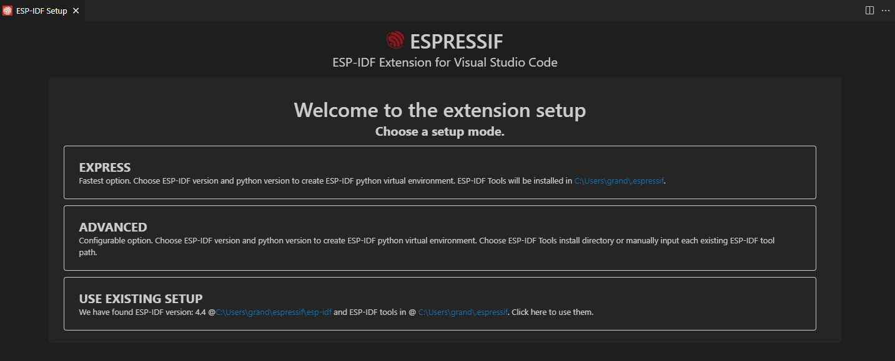
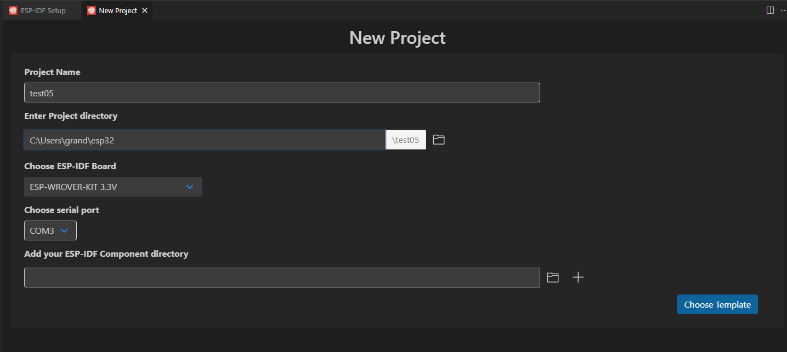
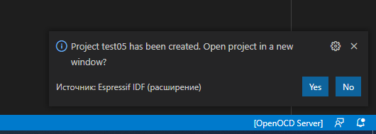

[Назад](./README.md)

##### VSCode <div id="espidflinuxvscodeplugin"></div>

1. Установка *Visual Studio Code* под *Window* мало отличается от установки *VSCode* под *Linux*.

Увы, у нас не получится, как в **Linux** трюк с «подхватыванием» переменных окружения после работы **export** 

Похтому, важно, чтобы **esp-idf** уже была установлена и экспортированы переменные 

IDF_PATH=%USERPROFILE%\espressif\esp-idf

IDF_TOOLS_PATH=%USERPROFILE%\.espressif\esp-idf

IDF_PYTHON_ENV_PATH=%USERPROFILE%\.espressif\python_env\idf4.4_py3.9_env

Нажмём на кнопку «Пуск» и вызовем «Настройки» (шестерёнка)


В строке поиска вводим слово «переменных» и видим «Настройка переменных окружения пользователя». Кликаем. Добавляем нужные переменные. Проверяем, добавлены ли в **Path** ```%ProgramFiles/Git/bin```, ```%ProgramFiles%/Python39``` (Зависит от установленной версии **Python**)


Здесь надо учитывать, что в зависимости от версии установленного **Python** и **esp-idf**, путь *IDF_PYTHON_ENV_PATH* к Python Virtual Environment будет меняться. Лучше всего этот путь будет скопировать из вывода set из Командной Строки ```cmd.exe set``` или в ```PowerShell``` вызвать что-то вроде ```echo $env:IDF_PYTHON_ENV_PATH``` после запуска ```$env:IDF_PATH\export.ps1```

```PowerShell
PS C:\Users\grand\esp32> echo $env:IDF_PYTHON_ENV_PATH
C:\Users\grand\.espressif\python_env\idf4.4_py3.9_env
```

2. Качаем *User Install* для установки в домашнем каталоге %USERPROFILE% (Устанавливается для каждого пользователя отдельно) или *System Install* по адресу https://code.visualstudio.com/download. Запускаем. Если все переменные окружения настроены корректно, после установки плагина **vscode-esp-mdf** и вызова **F1/>ESP-IDF: Настроить расширение ESP-IDF** Увидим предложение настроить уже установленную среду разработки **esp-idf**.

Переходим в меню плагинов, ищем **esp-idf**, устанавливаем


При помощи клавиши **F1** вызываем меню команд *VSCode* и найти **\>ESP-IDF: Настроить расширение EPS-IDF**


Если появился такой экран, всё в порядке. Выбираем «USE EXISTING SETUP»




3. Теперь, попробуем создать новый проект при помощи **Ctrl + E N**. Если нет, **F1 -> \>ESP-IDF: Команда врача** вставляем содержимое **Ctrl+V** в новый файл ищем, что не так. Выбираем какой-нибудь шаблон приложения. Например, «template-app» — Hello World).





Или Вы можете выбрать **Ctrl+E: C** — создать проект из шаблона расширения (т.е., из одного из примеров из ```%USERPROFILE%/espressif/esp-idf/examples```)


Или можно выбрать «\>ESP-IDF: Показать проекты примеров» и создать проект из выбранного примера:


10. Если всё прошло удачно (будьте внимательны, каталог, в котором создаётся новый проект должен существовать, иначе, будет сообщение об ошибке) соглашаемся открыть новое окно.





11. Пытаемся собрать проект. Иногда, после первого запуска случается так, что проект не собирается из-за того, что не хватает привилегий. С чем это связано, не знаю, но надо просто перезапустить *VSCode*


12. Запускаем сборку, прошивку и мониторинг проекта — **Ctrl+E D**. Обратите внимание: сверху может появиться выбор способа прошивки проекта: **UART/JTAG**. Выбираем **UART**.


13. Если всё прошло удачно, запустится мониторинг проекта с отображений журнала сообщений от процессора **ESP32**, передаваемых через **USB**.

[Назад](./README.md)
